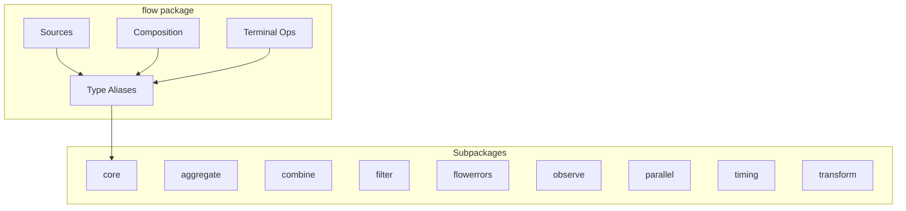

# flow

The `flow` package is the primary user-facing API for min-flow. Most users should only import this package.

## Overview

This package re-exports core types and provides stream sources, composition utilities, and terminal operations.



## Quick Start

```go
import "github.com/lguimbarda/min-flow/flow"

func main() {
    ctx := context.Background()

    // Create a stream from a slice
    stream := flow.FromSlice([]int{1, 2, 3, 4, 5})

    // Transform: double even numbers
    doubled := flow.Map(func(n int) (int, error) {
        if n%2 == 0 {
            return n * 2, nil
        }
        return n, nil
    }).Apply(ctx, stream)

    // Collect results
    results, err := flow.Slice(ctx, doubled)
    // results: [1, 4, 3, 8, 5]
}
```

## Stream Sources

Create streams from various sources:

```go
// From slice (most common)
stream := flow.FromSlice([]int{1, 2, 3})

// From channel
ch := make(chan int)
stream := flow.FromChannel(ch)

// From Go 1.23+ iterator
stream := flow.FromIter(slices.Values(mySlice))

// Generate values lazily
stream := flow.Generate(func() (int, bool, error) {
    return rand.Int(), true, nil
})

// Single value
stream := flow.Once(42)

// Empty stream
stream := flow.Empty[int]()

// Integer range
stream := flow.Range(0, 100)  // 0..99

// Repeat value
stream := flow.Repeat("hello", 5)

// Time-based
stream := flow.Timer(5 * time.Second)  // emits once after delay
stream := flow.Interval(time.Second)   // emits periodically
stream := flow.Tick(time.Second)       // alias for Interval
```

## Type Aliases

These aliases let you use core types without importing `flow/core`:

```go
// Result wraps stream items
var result flow.Result[int] = flow.Ok(42)
result = flow.Err[int](errors.New("failed"))

// Stream interface
var s flow.Stream[int]

// Transformer interface
var t flow.Transformer[int, string]

// Function types (all implement Transformer except Emitter which implements Stream)
var mapper flow.Mapper[int, int]           // 1:1 transformation
var flatMapper flow.FlatMapper[int, int]   // 1:N transformation
var emitter flow.Emitter[int]              // produces Stream
var transmitter flow.Transmitter[int, int] // channel-level transformation
var sink flow.Sink[int, []int]             // terminal operation
```

## Composition

Chain transformers together:

```go
// Through: chain two transformers of different types
intToString := flow.Map(strconv.Itoa)
stringToUpper := flow.Map(strings.ToUpper)
combined := flow.Through(intToString, stringToUpper)

// Chain: compose same-type transformers
pipeline := flow.Chain(
    filter.Where(isPositive),
    transform.Distinct[int](),
    filter.Take[int](10),
)

// Pipe: apply transformers to a stream inline
result := flow.Pipe(ctx, stream,
    filter.Where(isValid),
    transform.WithIndex[int](),
)

// Apply: single transformer application
result := flow.Apply(ctx, stream, myTransformer)
```

## Terminal Operations

Consume streams and produce final results. There are two styles:

### Function Style (Quick & Simple)

```go
// Collect all values into slice (stops on first error)
values, err := flow.Slice(ctx, stream)

// Get first value only
first, err := flow.First(ctx, stream)

// Run for side effects
err := flow.Run(ctx, stream)
```

### Sink Style (Composable & Parallel to Transformer)

Sinks mirror Transformers: where `Transformer.Apply(ctx, stream)` produces a Stream,
`Sink.From(ctx, stream)` produces a terminal result.

```go
// Same operations using Sink API
values, err := flow.ToSlice[int]().From(ctx, stream)
first, err := flow.ToFirst[int]().From(ctx, stream)
_, err := flow.ToRun[int]().From(ctx, stream)

// Sinks implement Transformer - use Apply to get a single-element Stream
resultStream := flow.ToSlice[int]().Apply(ctx, stream)  // Stream[[]int]
```

### Low-Level Result Iteration

```go
// Collect all Results (including errors)
results := flow.Collect(ctx, stream)

// Iterate with Go 1.23+ range
for result := range flow.All(ctx, stream) {
    if result.IsValue() {
        process(result.Value())
    }
}
```

## Constants

```go
// Default buffer size for internal channels
flow.DefaultBufferSize  // 64

// Sentinel error for stream termination
flow.ErrEndOfStream
```

## Package Organization

| Package           | Purpose                                |
| ----------------- | -------------------------------------- |
| `flow`            | Main API, sources, composition         |
| `flow/core`       | Core abstractions (no external deps)   |
| `flow/aggregate`  | Batching, reducing, windowing          |
| `flow/combine`    | Merging, splitting, zipping            |
| `flow/filter`     | Filtering, limiting, sampling          |
| `flow/flowerrors` | Error handling, retry, circuit breaker |
| `flow/observe`    | Metrics, logging, debugging            |
| `flow/parallel`   | Concurrent processing                  |
| `flow/timing`     | Delays, throttling, debouncing         |
| `flow/transform`  | Utility transformations                |

## Example Pipeline

```go
import (
    "github.com/lguimbarda/min-flow/flow"
    "github.com/lguimbarda/min-flow/flow/filter"
    "github.com/lguimbarda/min-flow/flow/aggregate"
    "github.com/lguimbarda/min-flow/flow/parallel"
)

func ProcessOrders(ctx context.Context, orders []Order) ([]ProcessedOrder, error) {
    return flow.Slice(ctx,
        flow.Pipe(ctx, flow.FromSlice(orders),
            filter.Where(Order.IsValid),
            parallel.Map(4, enrichOrder),
            aggregate.Batch[Order](100),
            parallel.Map(2, batchInsert),
        ),
    )
}
```
