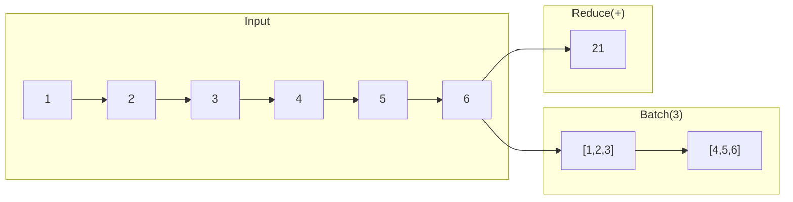
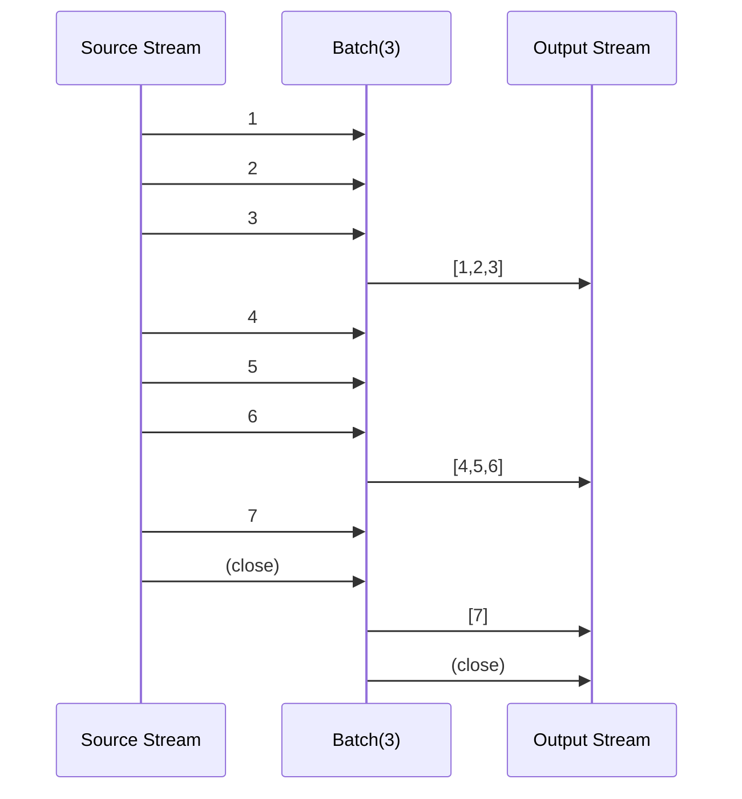

# aggregate

The `aggregate` package provides operators for collecting, reducing, and grouping stream items into aggregated results.

## Overview

Aggregation operators transform streams by collecting multiple items into single outputs—whether batches, reduced values, or time-windowed groups.



## Operators

### Batching

Collect items into fixed-size groups:

```go
// Batch into groups of 3
batched := aggregate.Batch[int](3).Apply(ctx, stream)
// [1,2,3,4,5,6,7] → [[1,2,3], [4,5,6], [7]]

// Batch with timeout (emit partial batch after duration)
timedBatch := aggregate.BatchTimeout[int](100, 5*time.Second).Apply(ctx, stream)

// Sliding window batches
sliding := aggregate.Buffer[int](3, 1).Apply(ctx, stream)
// [1,2,3,4,5] → [[1,2,3], [2,3,4], [3,4,5]]
```

### Reduction

Combine all items into a single value:

```go
// Reduce with first item as initial value
sum := aggregate.Reduce(func(acc, item int) int {
    return acc + item
}).Apply(ctx, stream)

// Fold with explicit initial value
sum := aggregate.Fold(0, func(acc int, item int) int {
    return acc + item
}).Apply(ctx, stream)

// Scan emits running accumulation
running := aggregate.Scan(0, func(acc, item int) int {
    return acc + item
}).Apply(ctx, stream)
// [1,2,3,4] → [1,3,6,10]
```

### Counting & Statistics

```go
// Count items
count := aggregate.Count[int]().Apply(ctx, stream)

// Min/Max
min := aggregate.Min(func(a, b int) bool { return a < b }).Apply(ctx, stream)
max := aggregate.Max(func(a, b int) bool { return a < b }).Apply(ctx, stream)

// Average (for numeric types)
avg := aggregate.Average[float64]().Apply(ctx, stream)
```

### Windowing

Group items by time:

```go
// Fixed time windows
windowed := aggregate.WindowTime[int](5 * time.Second).Apply(ctx, stream)
// Emits []int every 5 seconds with items received during that window

// Sliding time windows
sliding := aggregate.SlidingWindow[int](10*time.Second, 2*time.Second).Apply(ctx, stream)
// 10-second windows, emitted every 2 seconds

// Session windows (gap-based)
sessions := aggregate.SessionWindow[int](30 * time.Second).Apply(ctx, stream)
// New window starts after 30s of inactivity
```

### Grouping

Partition items by key:

```go
// Group by key function
grouped := aggregate.GroupBy(func(p Person) string {
    return p.Department
}).Apply(ctx, stream)
// Emits map[string][]Person when stream completes

// ToSlice collects all items
all := aggregate.ToSlice[int]().Apply(ctx, stream)

// ToMap with key/value extractors
m := aggregate.ToMap(
    func(p Person) int { return p.ID },
    func(p Person) string { return p.Name },
).Apply(ctx, stream)
```

## Data Flow



## Configuration

Use `AggregateConfig` for default batch sizes:

```go
ctx, registry := core.WithRegistry(ctx)
registry.Register(&aggregate.AggregateConfig{
    BatchSize:    100,
    BatchTimeout: 5 * time.Second,
})

// Now Batch(0) uses config default
batched := aggregate.Batch[int](0).Apply(ctx, stream)
```

## When to Use

| Operator        | Use Case                                      |
| --------------- | --------------------------------------------- |
| `Batch`         | Fixed-size processing (DB inserts, API calls) |
| `BatchTimeout`  | Time-sensitive batching (metrics, logs)       |
| `Reduce`/`Fold` | Final aggregation (sum, product, concat)      |
| `Scan`          | Running aggregation (cumulative sum)          |
| `WindowTime`    | Time-series analysis                          |
| `GroupBy`       | Categorization and partitioning               |
