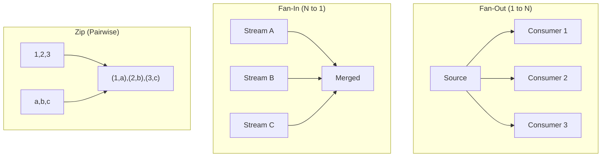
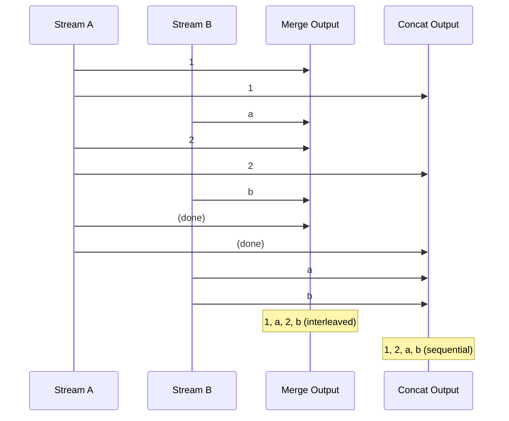
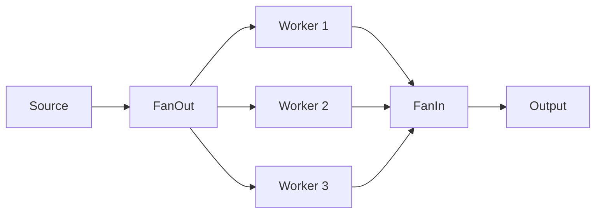

# combine

The `combine` package provides operators for merging, splitting, and combining multiple streams.

## Overview

Stream combination is essential for building complex data pipelines that integrate multiple data sources or distribute work across multiple consumers.



## Operators

### Merging (N → 1)

Combine multiple streams into one:

```go
// Merge: interleaved as items arrive
merged := combine.Merge(stream1, stream2, stream3)
// Order depends on timing

// Concat: sequential (stream2 starts after stream1 completes)
sequential := combine.Concat(stream1, stream2, stream3)
// Preserves order: all of stream1, then all of stream2, etc.

// Race: first stream to emit wins, others are cancelled
winner := combine.Race(stream1, stream2, stream3)
```

### Splitting (1 → N)

Distribute a stream to multiple consumers:

```go
// FanOut: broadcast to N identical streams
streams := combine.FanOut(3, sourceStream)
// Each stream[i] receives all items

// FanOutWith: route by selector function
streams := combine.FanOutWith(3, func(item Order) int {
    return item.Priority // 0=low, 1=med, 2=high
}, sourceStream)
// Items routed to specific streams

// Broadcast: explicit multi-consumer with guaranteed delivery
streams := combine.Broadcast(sourceStream, 3)

// Tee: split into exactly 2 streams
left, right := combine.Tee(sourceStream)
```

### Pairing (2 → 1)

Combine items from two streams:

```go
// Zip: pair items by position
pairs := combine.Zip(streamA, streamB)
// [1,2,3] + [a,b,c] → [(1,a), (2,b), (3,c)]

// ZipWith: custom combiner
sums := combine.ZipWith(streamA, streamB, func(a, b int) int {
    return a + b
})

// ZipLongest: continue until both exhausted (uses zero values)
all := combine.ZipLongest(streamA, streamB)

// Interleave: alternate items
interleaved := combine.Interleave(streamA, streamB)
// [1,2,3] + [a,b,c] → [1,a,2,b,3,c]
```

### Latest Value Combinations

```go
// CombineLatest: emit when any source emits, using latest from each
combined := combine.CombineLatest(stream1, stream2)
// Emits [latest1, latest2] whenever either updates

// WithLatestFrom: emit from source, decorated with latest from other
decorated := combine.WithLatestFrom(mainStream, refStream)
// mainStream drives timing, refStream provides context
```

## Data Flow Patterns

### Merge vs Concat



### FanOut Pattern



```go
// Distribute work, then collect results
workers := combine.FanOut(3, tasks)

results := make([]core.Stream[Result], 3)
for i, w := range workers {
    results[i] = process(w)
}

combined := combine.Merge(results...)
```

### Partition Pattern

```go
// Split stream by condition
evens, odds := combine.Partition(numbers, func(n int) bool {
    return n%2 == 0
})

// Or use FanOutWith for N-way partitioning
byPriority := combine.FanOutWith(3, priorityRouter, orders)
```

## Advanced Operators

```go
// Fork: process same stream with different transformers
result1, result2 := combine.Fork(stream, transformer1, transformer2)

// Gather: collect results from parallel operations
gathered := combine.Gather(parallelStream)

// SampleOn: emit source value when notifier fires
sampled := combine.SampleOn(dataStream, tickerStream)

// BufferWith: buffer until notifier signals
buffered := combine.BufferWith(dataStream, flushSignal)
```

## When to Use

| Operator        | Use Case                               |
| --------------- | -------------------------------------- |
| `Merge`         | Combine independent data sources       |
| `Concat`        | Process streams in sequence            |
| `FanOut`        | Parallel processing of same data       |
| `FanOutWith`    | Route items by content                 |
| `Zip`           | Pair related items from two sources    |
| `CombineLatest` | React to updates from multiple sources |
| `Race`          | First response wins (failover)         |
| `Partition`     | Split by condition                     |
