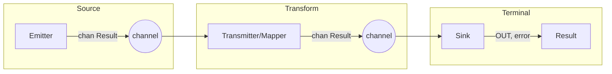
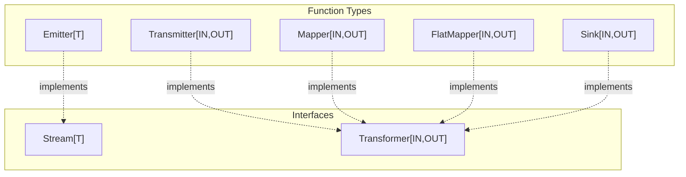
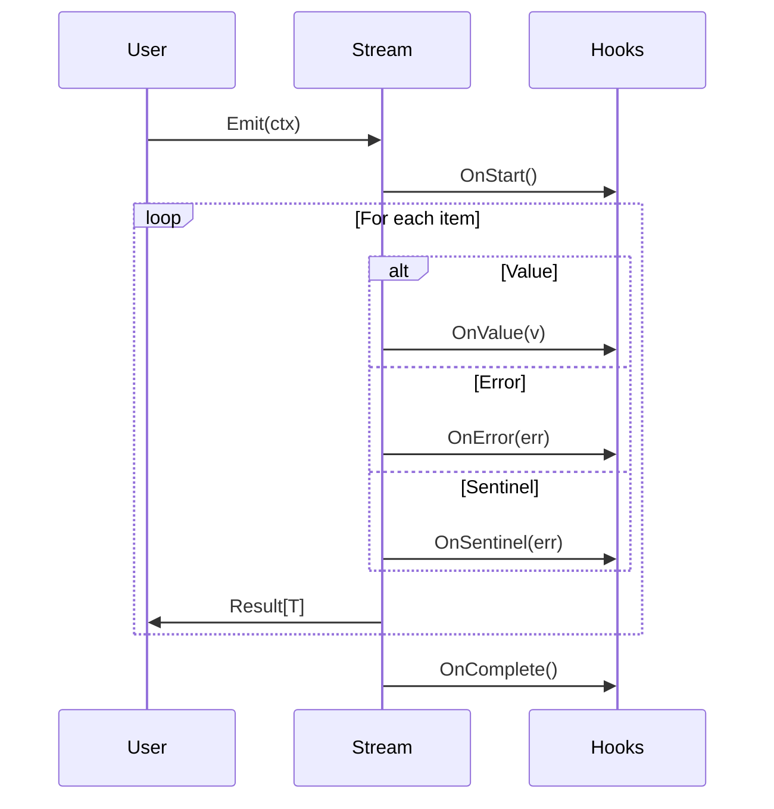

# core

The `core` package provides the foundational abstractions for min-flow's stream processing framework. This package has **no external dependencies** (stdlib only), ensuring portability and minimal footprint.

## Architecture

The core package implements a layered abstraction model with three tiers.

### Abstraction Layers (Horizontal View)

Each layer answers a different question about data flow:

```
┌─────────────────────────────────────────────────────────────────────────────┐
│  HIGH LEVEL (Interfaces)                                                    │
│  "What is the pipeline shape?"                                              │
│                                                                             │
│    Stream[T]  ──────────────►  Transformer[IN,OUT]  ──────────►  (output)   │
│    (source)                    (processing)                      (result)   │
└─────────────────────────────────────────────────────────────────────────────┘
                                      │
                                      ▼
┌─────────────────────────────────────────────────────────────────────────────┐
│  MID LEVEL (Function Types)                                                 │
│  "How do channels flow?"                                                    │
│                                                                             │
│    Emitter[T]  ─────►  Transmitter[IN,OUT]  ─────►  Sink[IN,OUT]            │
│    (produces)          (transforms)                 (consumes)              │
└─────────────────────────────────────────────────────────────────────────────┘
                                      │
                                      ▼
┌─────────────────────────────────────────────────────────────────────────────┐
│  LOW LEVEL (Pure Functions)                                                 │
│  "What happens to each item?"                                               │
│                                                                             │
│    Mapper[IN,OUT]  ────────────►  FlatMapper[IN,OUT]                        │
│    (1:1 transform)                (1:N transform)                           │
└─────────────────────────────────────────────────────────────────────────────┘
```

### Component Correspondence (Vertical View)

Components at each layer serve parallel roles:

```
              SOURCE              TRANSFORM             TERMINAL
           ─────────────────   ─────────────────   ─────────────────
 HIGH      │   Stream[T]   │   │ Transformer │   │               │
 (iface)   │   interface   │   │  interface  │   │   (n/a)       │
           ─────────────────   ─────────────────   ─────────────────
                  │                   │                   │
                  ▼                   ▼                   ▼
           ─────────────────   ─────────────────   ─────────────────
 MID       │  Emitter[T]  │   │ Transmitter │   │  Sink[IN,OUT] │
 (func)    │  func type   │   │  func type  │   │   func type   │
           ─────────────────   ─────────────────   ─────────────────
                  │                   │                   │
                  ▼                   ▼                   ▼
           ─────────────────   ─────────────────   ─────────────────
 LOW       │              │   │   Mapper    │   │               │
 (pure)    │   (n/a)      │   │ FlatMapper  │   │   (n/a)       │
           ─────────────────   ─────────────────   ─────────────────
                  │                   │                   │
                  └───────────────────┼───────────────────┘
                                      ▼
                            ─────────────────────
                            │   Result[T]       │
                            │ Ok | Err | Sentinel│
                            ─────────────────────
```

### Data Flow Through Pipeline



### Implements Relationship



## Core Types

### Result[T]

The fundamental data wrapper that flows through streams. Every item exists in one of three states:

| State        | Description                            | Check Method   |
| ------------ | -------------------------------------- | -------------- |
| **Value**    | Successful processing result           | `IsValue()`    |
| **Error**    | Recoverable failure (stream continues) | `IsError()`    |
| **Sentinel** | Control signal (e.g., end-of-stream)   | `IsSentinel()` |

```go
// Create results
ok := core.Ok(42)           // Value
err := core.Err[int](err)   // Error
eos := core.EndOfStream[int]() // Sentinel
```

### Stream[T] / Emitter[T]

A `Stream` represents a flow of data. `Emitter` is its function-type implementation.

```go
// Stream interface
type Stream[T any] interface {
    Emit(context.Context) <-chan Result[T]
    Collect(context.Context) []Result[T]
    All(context.Context) iter.Seq[Result[T]]
}

// Emitter implements Stream
stream := core.Emit(func(ctx context.Context) <-chan Result[int] {
    out := make(chan Result[int], 3)
    out <- core.Ok(1)
    out <- core.Ok(2)
    out <- core.Ok(3)
    close(out)
    return out
})
```

### Transformer[IN, OUT] / Transmitter[IN, OUT]

A `Transformer` converts one stream type to another. `Transmitter` is its function-type implementation.

```go
// Transformer interface
type Transformer[IN, OUT any] interface {
    Apply(Stream[IN]) Stream[OUT]
}

// Transmitter implements Transformer via Apply(stream)
double := core.Transmit(func(ctx context.Context, in <-chan Result[int]) <-chan Result[int] {
    out := make(chan Result[int])
    go func() {
        defer close(out)
        for res := range in {
            if res.IsValue() {
                out <- core.Ok(res.Value() * 2)
            }
        }
    }()
    return out
})

// Apply takes only stream; context comes from Emit(ctx)
result := double.Apply(stream)
```

### Mapper[IN, OUT] / FlatMapper[IN, OUT]

Low-level transformation functions with panic recovery.

```go
// Mapper: 1:1 transformation
double := core.Map(func(n int) (int, error) {
    return n * 2, nil
})

// FlatMapper: 1:N transformation
expand := core.FlatMap(func(n int) ([]int, error) {
    return []int{n, n*2, n*3}, nil
})
```

## Typed Hooks System

Hooks provide type-safe observation of stream events without modifying the stream.

```
┌─────────────────────────────────────────────────────────────────┐
│                     context.Context                             │
│  ┌───────────────────────────────────────────────────────────┐  │
│  │                   Hooks[T]                                │  │
│  │  ┌─────────┐ ┌─────────┐ ┌──────────┐ ┌──────────────┐   │  │
│  │  │OnStart  │ │OnValue  │ │OnError   │ │OnComplete    │   │  │
│  │  │func()   │ │func(T)  │ │func(err) │ │func()        │   │  │
│  │  └─────────┘ └─────────┘ └──────────┘ └──────────────┘   │  │
│  │                          ┌──────────┐                     │  │
│  │                          │OnSentinel│                     │  │
│  │                          │func(err) │                     │  │
│  │                          └──────────┘                     │  │
│  └───────────────────────────────────────────────────────────┘  │
└─────────────────────────────────────────────────────────────────┘
```

### Hooks Structure

```go
type Hooks[T any] struct {
    OnStart    func()           // Stream begins processing
    OnValue    func(T)          // Successful value emitted
    OnError    func(error)      // Error result emitted
    OnSentinel func(error)      // Sentinel emitted
    OnComplete func()           // Stream finished
}
```

### Attaching Hooks

```go
// Attach hooks to context
ctx = core.WithHooks(ctx, core.Hooks[int]{
    OnStart:    func() { log.Println("started") },
    OnValue:    func(v int) { log.Printf("value: %d", v) },
    OnError:    func(err error) { log.Printf("error: %v", err) },
    OnComplete: func() { log.Println("done") },
})

// Hooks fire automatically during Emit(ctx)
for res := range stream.Emit(ctx) { ... }
```

### Hook Invocation Flow



## Terminal Operations

Sinks consume streams and produce final results. They mirror the Transformer pattern:
where `Transformer.Apply(stream)` produces a Stream, `Sink.From(ctx, stream)` produces a result.

### Sink[IN, OUT]

A function type that implements both terminal consumption and Transformer:

```go
// Sink type
type Sink[IN, OUT any] func(context.Context, Stream[IN]) (OUT, error)

// From: consume stream and return result (primary method)
values, err := core.ToSlice[int]().From(ctx, stream)
first, err := core.ToFirst[int]().From(ctx, stream)
_, err := core.ToRun[int]().From(ctx, stream)

// Defer: lazy evaluation - returns a thunk to call later
thunk := core.ToSlice[int]().Defer(stream)
// ... define more of the pipeline ...
values, err := thunk(ctx)  // Execute when ready

// Apply: Sinks implement Transformer, producing single-element streams
resultStream := core.ToSlice[int]().Apply(stream)  // Stream[[]int]
```

### Sink Lifecycle

```
┌──────────────┐      ┌──────────────┐      ┌──────────────┐
│   Define     │      │    Defer     │      │   Execute    │
│   Sink       │─────►│   (lazy)     │─────►│   thunk(ctx) │
│              │      │              │      │              │
└──────────────┘      └──────────────┘      └──────────────┘
       │                                            │
       │              ┌──────────────┐              │
       └─────────────►│    From      │◄─────────────┘
                      │   (eager)    │
                      │              │
                      └──────────────┘
```

### Built-in Sinks

| Sink           | Description                   | Output Type |
| -------------- | ----------------------------- | ----------- |
| `ToSlice[T]()` | Collect all values into slice | `[]T`       |
| `ToFirst[T]()` | Return first value            | `T`         |
| `ToRun[T]()`   | Execute for side effects      | `struct{}`  |

### Free Functions (Convenience)

For quick usage without creating a Sink:

```go
values, err := core.Slice(ctx, stream)
first, err := core.First(ctx, stream)
err := core.Run(ctx, stream)
```

## Performance Features

### Fusion

Combine multiple mappers to eliminate intermediate channels:

```go
// Without fusion: 3 goroutines, 3 channels
mapper1.Apply(mapper2.Apply(mapper3.Apply(stream)))

// With fusion: 1 goroutine, 1 channel
fused := core.Fuse(core.Fuse(mapper1, mapper2), mapper3)
fused.Apply(stream)
```

```
Without Fusion                    With Fusion
─────────────────                 ─────────────────
┌──────┐   ┌──────┐   ┌──────┐   ┌────────────────┐
│  M1  │──►│  M2  │──►│  M3  │   │ Fuse(M1,M2,M3) │
└──────┘   └──────┘   └──────┘   └────────────────┘
   │          │          │              │
  chan       chan       chan          chan
  goroutine  goroutine  goroutine    goroutine
   (3)        (3)        (3)          (1)
```

### Buffered Channels

Default buffer size of 64 reduces goroutine synchronization:

```go
const DefaultBufferSize = 64

// Use custom buffer size
mapper.ApplyWith(ctx, stream, core.WithBufferSize(128))
```

## Design Principles

1. **No external dependencies** - stdlib only
2. **Errors are values** - wrapped in Result, stream continues
3. **Panics are recovered** - user functions can't crash the pipeline
4. **Context propagation** - cancellation and delegates flow through
5. **Generics throughout** - type-safe at compile time
