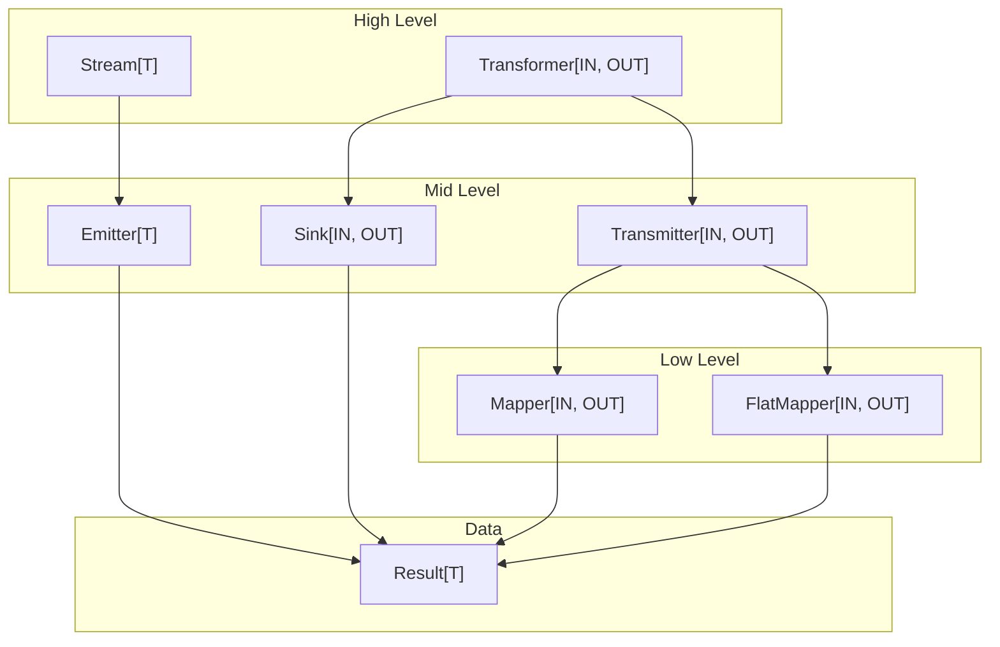
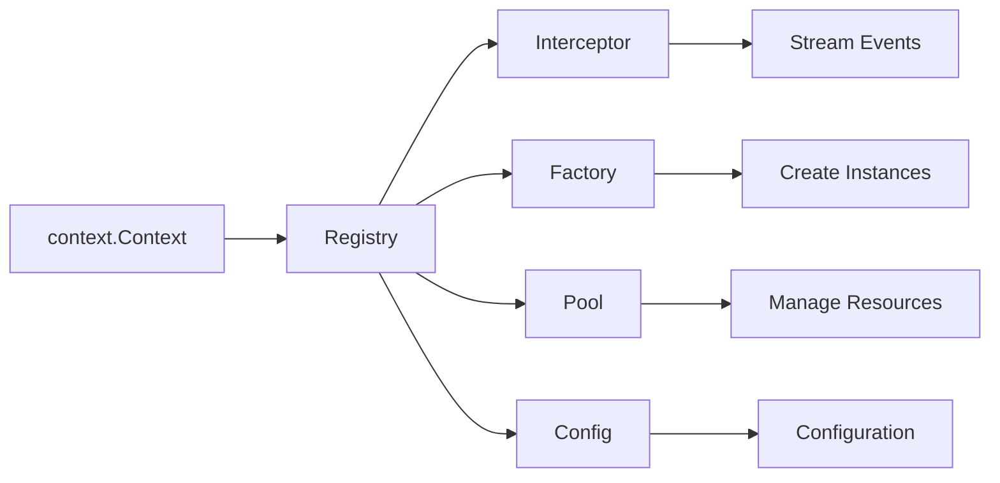

# core

The `core` package provides the foundational abstractions for min-flow's stream processing framework. This package has **no external dependencies** (stdlib only), ensuring portability and minimal footprint.

## Architecture

The core package implements a layered abstraction model:



## Core Types

### Result[T]

The fundamental data wrapper that flows through streams. Every item exists in one of three states:

| State        | Description                            | Check Method   |
| ------------ | -------------------------------------- | -------------- |
| **Value**    | Successful processing result           | `IsValue()`    |
| **Error**    | Recoverable failure (stream continues) | `IsError()`    |
| **Sentinel** | Control signal (e.g., end-of-stream)   | `IsSentinel()` |

```go
// Create results
ok := core.Ok(42)           // Value
err := core.Err[int](err)   // Error
eos := core.EndOfStream[int]() // Sentinel
```

### Stream[T] / Emitter[T]

A `Stream` represents a flow of data. `Emitter` is its function-type implementation.

```go
// Stream interface
type Stream[T any] interface {
    Emit(context.Context) <-chan Result[T]
    Collect(context.Context) []Result[T]
    All(context.Context) iter.Seq[Result[T]]
}

// Emitter implements Stream
stream := core.Emit(func(ctx context.Context) <-chan Result[int] {
    out := make(chan Result[int], 3)
    out <- core.Ok(1)
    out <- core.Ok(2)
    out <- core.Ok(3)
    close(out)
    return out
})
```

### Transformer[IN, OUT] / Transmitter[IN, OUT]

A `Transformer` converts one stream type to another. `Transmitter` is its function-type implementation.

```go
// Transformer interface
type Transformer[IN, OUT any] interface {
    Apply(context.Context, Stream[IN]) Stream[OUT]
}

// Transmitter implements Transformer
double := core.Transmit(func(ctx context.Context, in <-chan Result[int]) <-chan Result[int] {
    out := make(chan Result[int])
    go func() {
        defer close(out)
        for res := range in {
            if res.IsValue() {
                out <- core.Ok(res.Value() * 2)
            }
        }
    }()
    return out
})
```

### Mapper[IN, OUT] / FlatMapper[IN, OUT]

Low-level transformation functions with panic recovery.

```go
// Mapper: 1:1 transformation
double := core.Map(func(n int) (int, error) {
    return n * 2, nil
})

// FlatMapper: 1:N transformation
expand := core.FlatMap(func(n int) ([]int, error) {
    return []int{n, n*2, n*3}, nil
})
```

## Delegate System

The delegate system provides extensibility through registered components:



### Registry

Thread-safe storage for delegates, propagated via context:

```go
ctx, registry := core.WithRegistry(context.Background())
registry.Register(myInterceptor)
registry.Register(myConfig)
```

### Interceptor

Event handlers for observability:

```go
type Interceptor interface {
    Delegate
    Events() []Event       // Which events to handle
    Do(context.Context, Event, ...any) error
}

// Available events
StreamStart      // Stream begins
StreamEnd        // Stream completes
ItemReceived     // Any item received
ValueReceived    // Successful value received
ErrorOccurred    // Error result received
SentinelReceived // Sentinel received
ItemEmitted      // Item sent downstream
```

## Terminal Operations

Sinks consume streams and produce final results. They mirror the Transformer pattern:
where `Transformer.Apply(ctx, stream)` produces a Stream, `Sink.From(ctx, stream)` produces a result.

### Sink[IN, OUT]

A function type that implements both terminal consumption and Transformer:

```go
// Sink type
type Sink[IN, OUT any] func(context.Context, Stream[IN]) (OUT, error)

// From: consume stream and return result (mirrors Apply)
values, err := core.ToSlice[int]().From(ctx, stream)
first, err := core.ToFirst[int]().From(ctx, stream)
_, err := core.ToRun[int]().From(ctx, stream)

// Apply: Sinks implement Transformer, producing single-element streams
resultStream := core.ToSlice[int]().Apply(ctx, stream)  // Stream[[]int]
```

### Built-in Sinks

| Sink           | Description                   | Output Type |
| -------------- | ----------------------------- | ----------- |
| `ToSlice[T]()` | Collect all values into slice | `[]T`       |
| `ToFirst[T]()` | Return first value            | `T`         |
| `ToRun[T]()`   | Execute for side effects      | `struct{}`  |

### Free Functions (Convenience)

For quick usage without creating a Sink:

```go
values, err := core.Slice(ctx, stream)
first, err := core.First(ctx, stream)
err := core.Run(ctx, stream)
```

## Performance Features

### Fusion

Combine multiple mappers to eliminate intermediate channels:

```go
// Without fusion: 3 goroutines, 3 channels
stream.Apply(ctx, mapper1).Apply(ctx, mapper2).Apply(ctx, mapper3)

// With fusion: 1 goroutine, 1 channel
fused := core.Fuse(core.Fuse(mapper1, mapper2), mapper3)
stream.Apply(ctx, fused)
```

### Buffered Channels

Default buffer size of 64 reduces goroutine synchronization:

```go
const DefaultBufferSize = 64

// Use custom buffer size
mapper.ApplyWith(ctx, stream, core.WithBufferSize(128))
```

## Design Principles

1. **No external dependencies** - stdlib only
2. **Errors are values** - wrapped in Result, stream continues
3. **Panics are recovered** - user functions can't crash the pipeline
4. **Context propagation** - cancellation and delegates flow through
5. **Generics throughout** - type-safe at compile time
