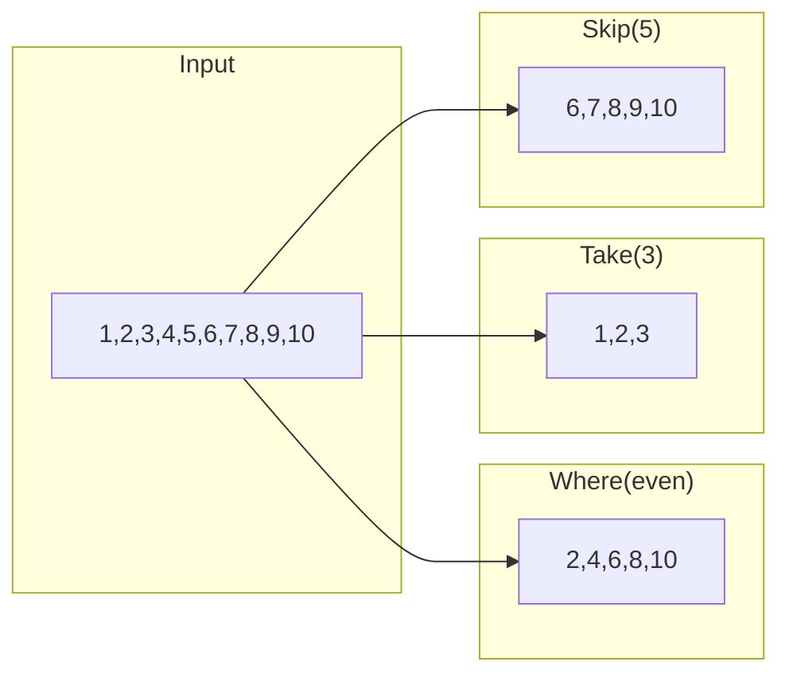
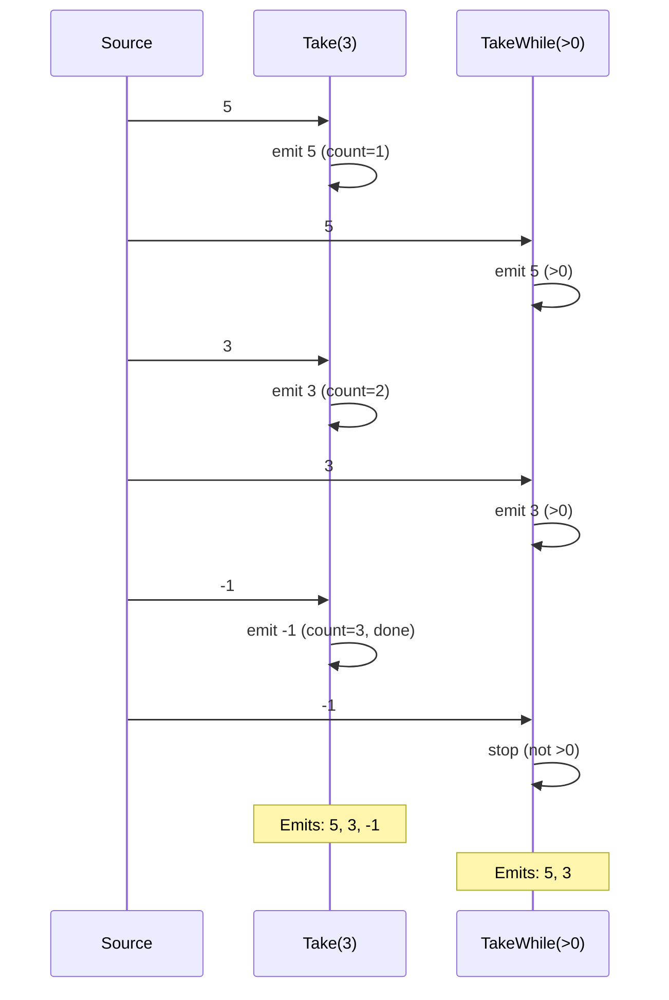
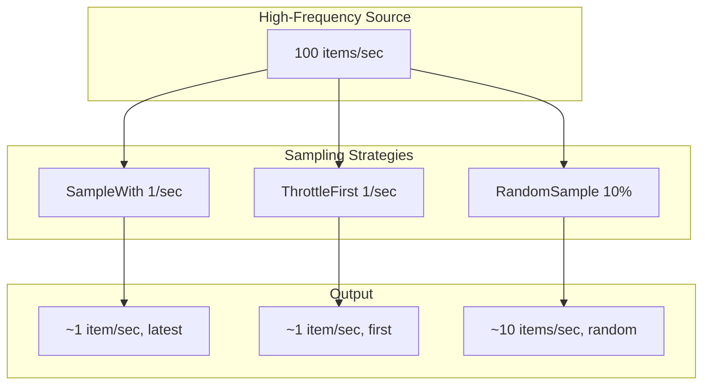

# filter

The `filter` package provides operators for selecting, limiting, and sampling items from streams.

## Overview

Filter operators control which items pass through a stream—whether by predicate, count, position, or sampling strategy.



## Operators

### Predicate Filtering

```go
// Where: keep items matching predicate
evens := filter.Where(func(n int) bool {
    return n%2 == 0
}).Apply(ctx, stream)

// MapWhere: filter and transform in one pass
validUsers := filter.MapWhere(func(raw RawUser) (User, bool) {
    if raw.Email == "" {
        return User{}, false // filter out
    }
    return User{Name: raw.Name, Email: raw.Email}, true
}).Apply(ctx, stream)

// Errors: keep only error results
errorsOnly := filter.Errors[int]().Apply(ctx, stream)
```

### Count-Based Limiting

```go
// Take: first N items
first10 := filter.Take[int](10).Apply(ctx, stream)

// Skip: skip first N items
afterFirst10 := filter.Skip[int](10).Apply(ctx, stream)

// TakeLast: last N items (buffers entire stream)
last5 := filter.TakeLast[int](5).Apply(ctx, stream)

// SkipLast: all except last N items
allButLast3 := filter.SkipLast[int](3).Apply(ctx, stream)
```

### Condition-Based Limiting

```go
// TakeWhile: take while predicate is true
positive := filter.TakeWhile(func(n int) bool {
    return n > 0
}).Apply(ctx, stream)
// [5,3,1,-2,4] → [5,3,1] (stops at first negative)

// SkipWhile: skip while predicate is true
afterZeros := filter.SkipWhile(func(n int) bool {
    return n == 0
}).Apply(ctx, stream)
// [0,0,0,1,2,0,3] → [1,2,0,3]

// TakeUntil: take until signal stream emits
limited := filter.TakeUntil(cancelSignal).Apply(ctx, stream)

// SkipUntil: skip until signal stream emits
afterSignal := filter.SkipUntil(startSignal).Apply(ctx, stream)
```

### Uniqueness

```go
// Distinct: remove consecutive duplicates
unique := filter.Distinct[int]().Apply(ctx, stream)
// [1,1,2,2,2,3,1] → [1,2,3,1]

// DistinctBy: distinct by key function
uniqueByName := filter.DistinctBy(func(p Person) string {
    return p.Name
}).Apply(ctx, stream)

// DistinctUntilChanged: only emit when value changes
changes := filter.DistinctUntilChanged[int]().Apply(ctx, stream)
```

### Positional Selection

```go
// First: only the first item
first := filter.First[int]().Apply(ctx, stream)

// Last: only the last item (waits for stream to complete)
last := filter.Last[int]().Apply(ctx, stream)

// ElementAt: item at specific index (0-based)
third := filter.ElementAt[int](2).Apply(ctx, stream)

// Single: exactly one item (errors if 0 or >1)
single := filter.Single[int]().Apply(ctx, stream)
```

### Sampling

```go
// SampleWith: emit latest when sampler fires
sampled := filter.SampleWith(tickerStream).Apply(ctx, dataStream)

// AuditTime: after source emits, wait duration, emit latest
audited := filter.AuditTime[int](100 * time.Millisecond).Apply(ctx, stream)

// ThrottleFirst: emit first, ignore for duration
throttled := filter.ThrottleFirst[int](time.Second).Apply(ctx, stream)

// RandomSample: probabilistic sampling
sampled := filter.RandomSample[int](0.1).Apply(ctx, stream) // 10% sample

// ReservoirSample: uniform random sample of fixed size
sample := filter.ReservoirSample[int](100).Apply(ctx, stream)
```

## Data Flow

### Take vs TakeWhile



### Sampling Pattern



## Conditional Operators

```go
// DefaultIfEmpty: emit default if stream is empty
withDefault := filter.DefaultIfEmpty(0).Apply(ctx, stream)

// IfEmpty: use alternative stream if source is empty
withFallback := filter.IfEmpty(fallbackStream).Apply(ctx, stream)

// ThrowIfEmpty: error if stream is empty
mustHaveItems := filter.ThrowIfEmpty[int](errors.New("no data")).Apply(ctx, stream)
```

## When to Use

| Operator                | Use Case                   |
| ----------------------- | -------------------------- |
| `Where`                 | Filter by condition        |
| `Take`/`Skip`           | Pagination, limiting       |
| `TakeWhile`/`SkipWhile` | Stop/start at condition    |
| `Distinct`              | Deduplicate                |
| `SampleWith`            | Reduce high-frequency data |
| `First`/`Last`          | Extract single item        |
| `DefaultIfEmpty`        | Handle empty streams       |
