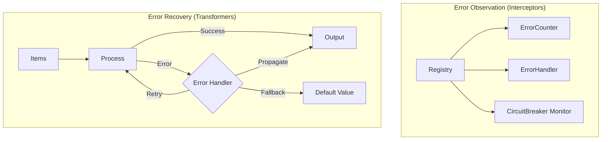
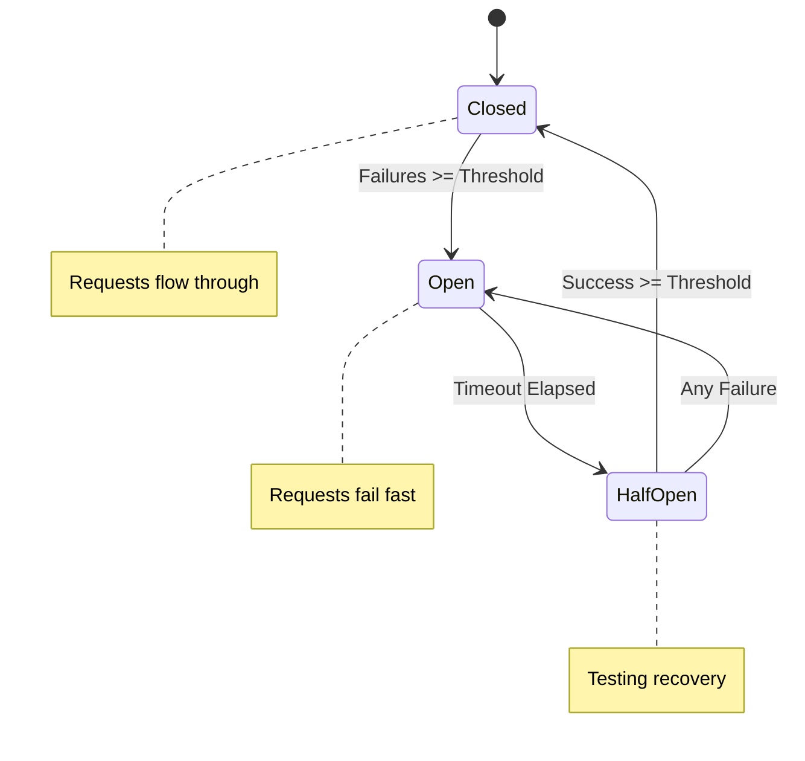

# flowerrors

The `flowerrors` package provides error handling, resilience, and recovery operators for building fault-tolerant stream pipelines.

## Overview

Production systems need to handle failures gracefully. This package provides:

1. **Interceptor-based observers** (for monitoring): Observe errors for logging, counting, alerting
2. **Transformer-based operators** (for recovery): Retry, fallback, catch, circuit breaker



## Quick Start: Error Observation

```go
// Set up registry and error observers
ctx, registry := core.WithRegistry(context.Background())

// Log all errors
flowerrors.OnErrorDo(registry, func(err error) {
    log.Printf("Error: %v", err)
})

// Count errors
counter, _ := flowerrors.WithErrorCounter(registry, nil)

// Collect errors for later inspection
collector, _ := flowerrors.WithErrorCollector(registry)

// Process stream - observers fire automatically!
result := mapper.Apply(ctx, stream)
values, _ := core.Slice(ctx, result)

fmt.Printf("Errors encountered: %d\n", counter.Count())
for _, err := range collector.Errors() {
    fmt.Printf("  - %v\n", err)
}
```

## Registration Functions

### Error Callbacks

```go
// Simple error handler
flowerrors.OnErrorDo(registry, func(err error) {
    log.Error("Stream error:", err)
    metrics.IncrementErrors()
})
```

### Error Counting

```go
// Count all errors
counter, _ := flowerrors.WithErrorCounter(registry, nil)

// Count specific errors
counter, _ := flowerrors.WithErrorCounter(registry, func(err error) bool {
    return errors.Is(err, ErrTimeout)
})

// Later: counter.Count()
```

### Error Collection

```go
// Collect all errors
collector, _ := flowerrors.WithErrorCollector(registry)

// Collect with limit
collector, _ := flowerrors.WithErrorCollector(registry,
    flowerrors.WithMaxErrors(100),
)

// Collect specific errors
collector, _ := flowerrors.WithErrorCollector(registry,
    flowerrors.WithErrorPredicate(isRetryable),
)

// Later: collector.Errors(), collector.Count(), collector.Clear()
```

### Circuit Breaker Monitor

```go
// Monitor error rates and alert when threshold hit
cb, _ := flowerrors.WithCircuitBreakerMonitor(registry, 5, func() {
    alert.Send("Error threshold reached!")
})

// Later: cb.IsOpen(), cb.FailureCount(), cb.Reset()
```

### Retry Patterns

```go
// Retry: retry failed items N times
retried := flowerrors.Retry(3, func(item Request) (Response, error) {
    return client.Call(item)
}).Apply(ctx, stream)

// RetryWithBackoff: exponential backoff
retried := flowerrors.RetryWithBackoff(3,
    flowerrors.ExponentialBackoff(100*time.Millisecond, 2.0),
    processItem,
).Apply(ctx, stream)

// RetryWhen: custom retry logic
retried := flowerrors.RetryWhen(func(err error, attempt int) bool {
    return attempt < 5 && isTransient(err)
}, process).Apply(ctx, stream)
```

### Circuit Breaker

Protect downstream services from cascading failures:

```go
cb := flowerrors.NewCircuitBreaker(flowerrors.CircuitBreakerConfig{
    FailureThreshold: 5,         // Open after 5 failures
    SuccessThreshold: 2,         // Close after 2 successes
    Timeout:          30*time.Second, // Half-open after timeout
})

protected := flowerrors.WithCircuitBreaker(cb, callService).Apply(ctx, stream)
```



### Timeout

```go
// Per-item timeout
timed := flowerrors.Timeout(5*time.Second, processItem).Apply(ctx, stream)

// With custom timeout error
timed := flowerrors.TimeoutWith(5*time.Second,
    errors.New("operation timed out"),
    processItem,
).Apply(ctx, stream)
```

## Backoff Strategies

```go
// Constant delay
backoff := flowerrors.ConstantBackoff(100 * time.Millisecond)

// Exponential backoff
backoff := flowerrors.ExponentialBackoff(100*time.Millisecond, 2.0)
// Delays: 100ms, 200ms, 400ms, 800ms...

// Exponential with jitter (recommended for distributed systems)
backoff := flowerrors.ExponentialJitterBackoff(100*time.Millisecond, 2.0, 0.1)

// Fibonacci backoff
backoff := flowerrors.FibonacciBackoff(100 * time.Millisecond)
// Delays: 100ms, 100ms, 200ms, 300ms, 500ms...

// Custom backoff
backoff := flowerrors.BackoffFunc(func(attempt int) time.Duration {
    return time.Duration(attempt*100) * time.Millisecond
})
```

## Error Recovery Patterns

### Fallback Chain

```go
// Try multiple fallback sources
result := flowerrors.OnErrorResumeNext(
    flowerrors.OnErrorResumeNext(
        flowerrors.OnErrorResumeNext(primarySource, secondarySource),
        tertiarySource,
    ),
    cachedSource,
)
```

### Graceful Degradation

```go
// Complex error handling pipeline
processed := stream.
    Apply(ctx, flowerrors.Retry(3, callPrimaryService)).
    Apply(ctx, flowerrors.CatchError(
        isNetworkError,
        func(err error) (Result, error) {
            return callFallbackService()
        },
    )).
    Apply(ctx, flowerrors.OnErrorReturn(cachedResult))
```

## Configuration

Use `RetryConfig` for default retry settings:

```go
ctx, registry := core.WithRegistry(ctx)
registry.Register(&flowerrors.RetryConfig{
    MaxRetries: 5,
    Backoff:    flowerrors.ExponentialBackoff(100*time.Millisecond, 2.0),
})

// Now Retry(0, ...) uses config defaults
retried := flowerrors.Retry(0, process).Apply(ctx, stream)
```

## Error Interceptor

For cross-cutting error handling:

```go
// Simple error handler interceptor
interceptor := flowerrors.NewErrorHandlerInterceptor(func(err error) {
    metrics.IncrementErrorCount(err)
    logger.Error("stream error", "error", err)
})
registry.Register(interceptor)

// Error counter interceptor
counter := flowerrors.NewErrorCounterInterceptor(nil) // nil = count all
registry.Register(counter)

// Error collector interceptor
collector := flowerrors.NewErrorCollectorInterceptor(
    flowerrors.WithMaxErrors(100),
)
registry.Register(collector)

// Circuit breaker monitor interceptor
cbMonitor := flowerrors.NewCircuitBreakerInterceptor(5, func() {
    alert.Send("Too many errors!")
})
registry.Register(cbMonitor)
```

## Deprecated Transformer-Based Observers

The following operators are deprecated. Use the interceptor-based alternatives:

| Deprecated                | Use Instead                       |
| ------------------------- | --------------------------------- |
| `OnError[T](handler)`     | `OnErrorDo(registry, handler)`    |
| `CountErrors[T](counter)` | `WithErrorCounter(registry, nil)` |

## When to Use

| Approach                    | Use Case                        |
| --------------------------- | ------------------------------- |
| `OnErrorDo`                 | Logging, alerting on errors     |
| `WithErrorCounter`          | Counting errors for metrics     |
| `WithErrorCollector`        | Collecting errors for reporting |
| `WithCircuitBreakerMonitor` | Alerting on error rate spikes   |
| `CatchError`                | Handle specific error types     |
| `Retry`                     | Retry transient failures        |
| `CircuitBreaker`            | Protect downstream services     |
| `Fallback`                  | Provide default values          |
