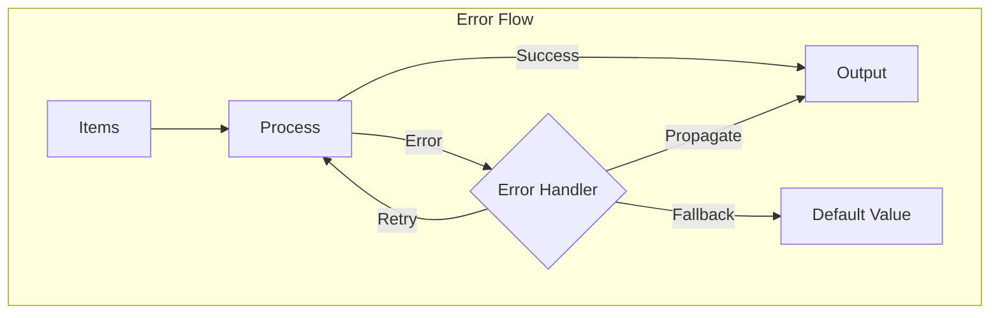
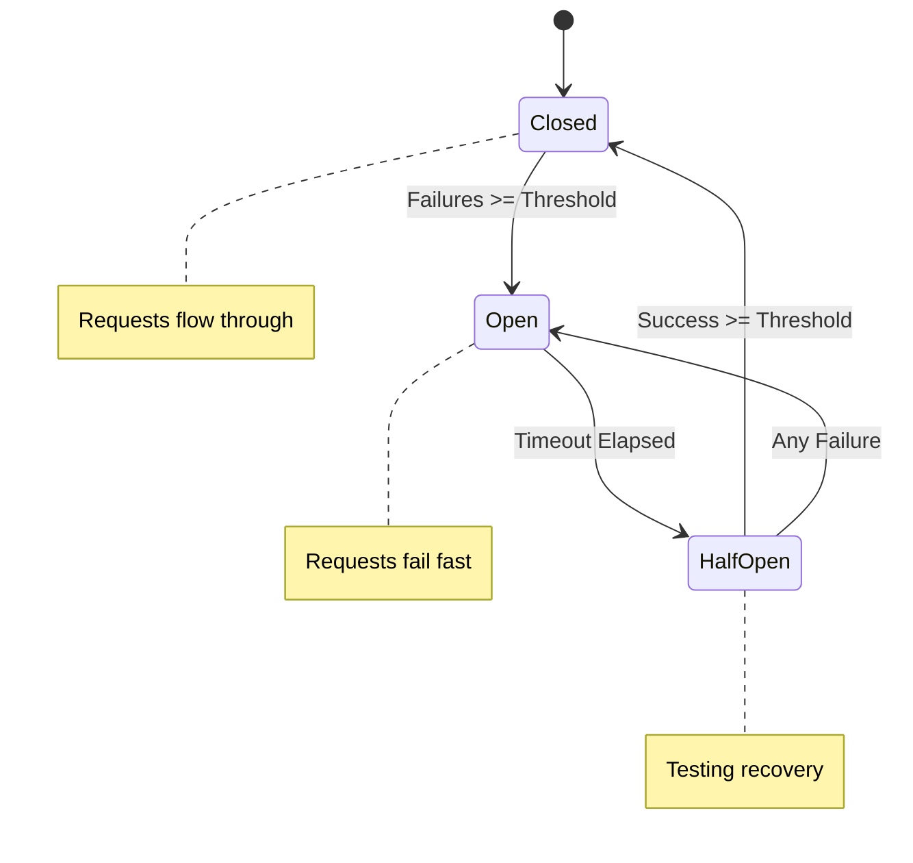

# flowerrors

The `flowerrors` package provides error handling, resilience, and recovery operators for building fault-tolerant stream pipelines.

## Overview

Production systems need to handle failures gracefully. This package provides operators for catching, retrying, and recovering from errors without losing data.



## Error Handling Operators

### Catching Errors

```go
// OnError: side effect on error (logging, metrics)
logged := flowerrors.OnError(func(err error) {
    log.Printf("Error: %v", err)
}).Apply(ctx, stream)

// CatchError: handle specific errors
recovered := flowerrors.CatchError(
    func(err error) bool { return errors.Is(err, ErrNotFound) },
    func(err error) (Item, error) { return defaultItem, nil },
).Apply(ctx, stream)

// OnErrorResumeNext: switch to fallback on error
withFallback := flowerrors.OnErrorResumeNext(fallbackStream).Apply(ctx, stream)

// OnErrorReturn: replace error with value
safe := flowerrors.OnErrorReturn(defaultValue).Apply(ctx, stream)
```

### Retry Patterns

```go
// Retry: retry failed items N times
retried := flowerrors.Retry(3, func(item Request) (Response, error) {
    return client.Call(item)
}).Apply(ctx, stream)

// RetryWithBackoff: exponential backoff
retried := flowerrors.RetryWithBackoff(3,
    flowerrors.ExponentialBackoff(100*time.Millisecond, 2.0),
    processItem,
).Apply(ctx, stream)

// RetryWhen: custom retry logic
retried := flowerrors.RetryWhen(func(err error, attempt int) bool {
    return attempt < 5 && isTransient(err)
}, process).Apply(ctx, stream)
```

### Circuit Breaker

Protect downstream services from cascading failures:

```go
cb := flowerrors.NewCircuitBreaker(flowerrors.CircuitBreakerConfig{
    FailureThreshold: 5,         // Open after 5 failures
    SuccessThreshold: 2,         // Close after 2 successes
    Timeout:          30*time.Second, // Half-open after timeout
})

protected := flowerrors.WithCircuitBreaker(cb, callService).Apply(ctx, stream)
```



### Timeout

```go
// Per-item timeout
timed := flowerrors.Timeout(5*time.Second, processItem).Apply(ctx, stream)

// With custom timeout error
timed := flowerrors.TimeoutWith(5*time.Second,
    errors.New("operation timed out"),
    processItem,
).Apply(ctx, stream)
```

## Backoff Strategies

```go
// Constant delay
backoff := flowerrors.ConstantBackoff(100 * time.Millisecond)

// Exponential backoff
backoff := flowerrors.ExponentialBackoff(100*time.Millisecond, 2.0)
// Delays: 100ms, 200ms, 400ms, 800ms...

// Exponential with jitter (recommended for distributed systems)
backoff := flowerrors.ExponentialJitterBackoff(100*time.Millisecond, 2.0, 0.1)

// Fibonacci backoff
backoff := flowerrors.FibonacciBackoff(100 * time.Millisecond)
// Delays: 100ms, 100ms, 200ms, 300ms, 500ms...

// Custom backoff
backoff := flowerrors.BackoffFunc(func(attempt int) time.Duration {
    return time.Duration(attempt*100) * time.Millisecond
})
```

## Error Recovery Patterns

### Fallback Chain

```go
// Try multiple fallback sources
result := flowerrors.OnErrorResumeNext(
    flowerrors.OnErrorResumeNext(
        flowerrors.OnErrorResumeNext(primarySource, secondarySource),
        tertiarySource,
    ),
    cachedSource,
)
```

### Graceful Degradation

```go
// Complex error handling pipeline
processed := stream.
    Apply(ctx, flowerrors.Retry(3, callPrimaryService)).
    Apply(ctx, flowerrors.CatchError(
        isNetworkError,
        func(err error) (Result, error) {
            return callFallbackService()
        },
    )).
    Apply(ctx, flowerrors.OnErrorReturn(cachedResult))
```

## Configuration

Use `RetryConfig` for default retry settings:

```go
ctx, registry := core.WithRegistry(ctx)
registry.Register(&flowerrors.RetryConfig{
    MaxRetries: 5,
    Backoff:    flowerrors.ExponentialBackoff(100*time.Millisecond, 2.0),
})

// Now Retry(0, ...) uses config defaults
retried := flowerrors.Retry(0, process).Apply(ctx, stream)
```

## Error Interceptor

For cross-cutting error handling:

```go
interceptor := flowerrors.NewErrorInterceptor(func(err error) {
    metrics.IncrementErrorCount(err)
    logger.Error("stream error", "error", err)
})

ctx, registry := core.WithRegistry(ctx)
registry.Register(interceptor)
```

## When to Use

| Operator            | Use Case                    |
| ------------------- | --------------------------- |
| `OnError`           | Logging, metrics            |
| `CatchError`        | Handle specific error types |
| `Retry`             | Transient failures          |
| `RetryWithBackoff`  | Rate-limited retries        |
| `CircuitBreaker`    | Protect downstream services |
| `Timeout`           | Bound operation time        |
| `OnErrorReturn`     | Default values              |
| `OnErrorResumeNext` | Fallback sources            |
