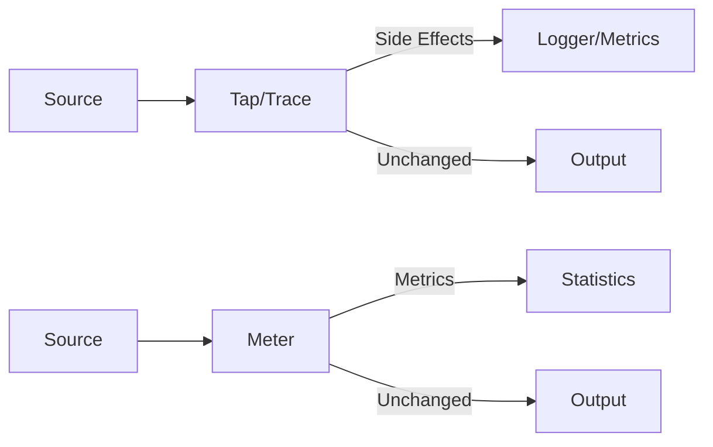
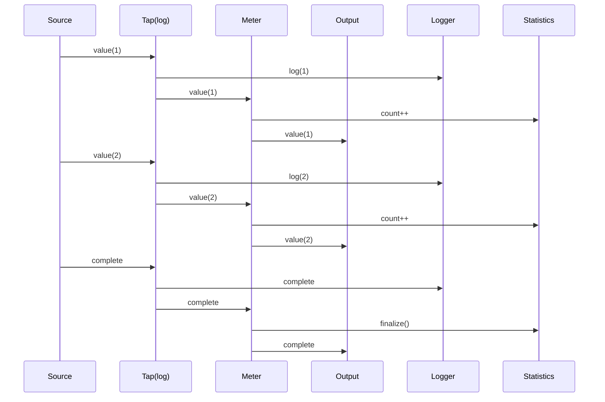

# observe

The `observe` package provides operators for monitoring, debugging, and collecting metrics from streams without affecting their behavior.

## Overview

Observability is crucial for understanding stream behavior in production. These operators allow you to inspect, measure, and debug streams transparently.



## Operators

### Side Effect Operators

```go
// Tap: observe each item without modification
observed := observe.Tap(func(item Order) {
    fmt.Printf("Processing order: %s\n", item.ID)
}).Apply(ctx, stream)

// TapError: observe errors only
withLogging := observe.TapError(func(err error) {
    log.Printf("Error occurred: %v", err)
}).Apply(ctx, stream)

// Do: comprehensive observer for all result types
monitored := observe.Do(observe.Observer[int]{
    OnNext:     func(v int) { fmt.Println("Value:", v) },
    OnError:    func(e error) { log.Println("Error:", e) },
    OnComplete: func() { fmt.Println("Done") },
}).Apply(ctx, stream)
```

### Debugging

```go
// Trace: log all items with optional prefix
traced := observe.Trace[int]("mystream").Apply(ctx, stream)
// Output: [mystream] Value: 42
// Output: [mystream] Error: something failed
// Output: [mystream] Complete

// Materialize: convert items to explicit notifications
notifications := observe.Materialize[int]().Apply(ctx, stream)
// Values become Notification{Kind: "N", Value: 42}
// Errors become Notification{Kind: "E", Error: err}
// Complete becomes Notification{Kind: "C"}

// Dematerialize: convert notifications back to items
items := observe.Dematerialize[int]().Apply(ctx, notificationStream)
```

### Metrics Collection

```go
// Meter: collect comprehensive stream statistics
metered := observe.Meter(func(m observe.StreamMetrics) {
    fmt.Printf("Total: %d items in %v\n", m.TotalItems, m.EndTime.Sub(m.StartTime))
    fmt.Printf("Throughput: %.2f items/sec\n", m.ItemsPerSecond)
    fmt.Printf("Errors: %d\n", m.ErrorCount)
}).Apply(ctx, stream)

// Count: emit count when stream completes
counted := observe.Count[int]().Apply(ctx, stream)

// TimeInterval: add timestamps to items
timed := observe.TimeInterval[int]().Apply(ctx, stream)
// Emits Timed[int]{Value: 42, Interval: 100ms}
```

### StreamMetrics

The `Meter` operator collects:

| Metric                                     | Description           |
| ------------------------------------------ | --------------------- |
| `TotalItems`                               | Total items processed |
| `ValueCount`                               | Successful values     |
| `ErrorCount`                               | Error results         |
| `SentinelCount`                            | Sentinel signals      |
| `StartTime` / `EndTime`                    | Stream duration       |
| `ItemsPerSecond`                           | Throughput            |
| `MinLatency` / `MaxLatency` / `AvgLatency` | Time between items    |

## Interceptor-Based Observation

For global observability, use interceptors:

```go
// Create a metrics interceptor
type MetricsInterceptor struct {
    itemCount atomic.Int64
    errorCount atomic.Int64
}

func (m *MetricsInterceptor) Events() []core.Event {
    return []core.Event{core.ValueReceived, core.ErrorOccurred}
}

func (m *MetricsInterceptor) Do(ctx context.Context, event core.Event, args ...any) error {
    switch event {
    case core.ValueReceived:
        m.itemCount.Add(1)
    case core.ErrorOccurred:
        m.errorCount.Add(1)
    }
    return nil
}

// Register globally
ctx, registry := core.WithRegistry(ctx)
registry.Register(&MetricsInterceptor{})
```

## Lifecycle Hooks

```go
// DoOnSubscribe: called when stream starts consuming
started := observe.DoOnSubscribe(func() {
    log.Println("Stream started")
}).Apply(ctx, stream)

// DoOnComplete: called when stream completes normally
completed := observe.DoOnComplete(func() {
    log.Println("Stream completed")
}).Apply(ctx, stream)

// DoOnCancel: called when context is cancelled
withCancel := observe.DoOnCancel(func() {
    log.Println("Stream cancelled")
}).Apply(ctx, stream)

// DoFinally: always called (complete, error, or cancel)
cleanup := observe.DoFinally(func() {
    log.Println("Stream ended")
    resources.Release()
}).Apply(ctx, stream)
```

## Data Flow with Observation



## Built-in Interceptors

```go
// Counter interceptor
counter := observe.NewCounterInterceptor()
registry.Register(counter)
// Later: counter.Count() returns total items

// Timing interceptor
timing := observe.NewTimingInterceptor()
registry.Register(timing)
// Later: timing.Duration() returns stream duration

// Logger interceptor
logger := observe.NewLoggerInterceptor(log.Default(), observe.LogAll)
registry.Register(logger)
```

## When to Use

| Operator       | Use Case                    |
| -------------- | --------------------------- |
| `Tap`          | Logging, debugging          |
| `TapError`     | Error monitoring            |
| `Meter`        | Production metrics          |
| `Trace`        | Development debugging       |
| `Materialize`  | Testing, serialization      |
| `DoOnComplete` | Cleanup, notifications      |
| Interceptors   | Cross-cutting observability |
