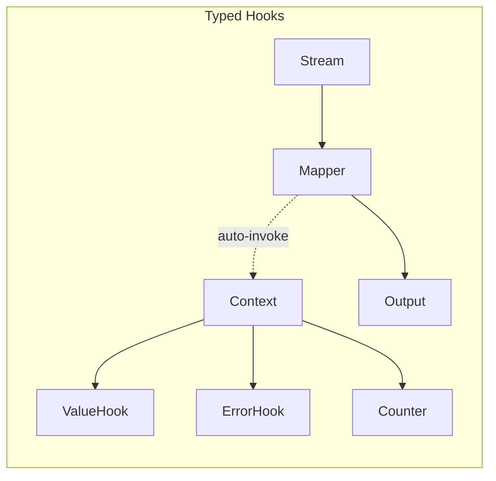
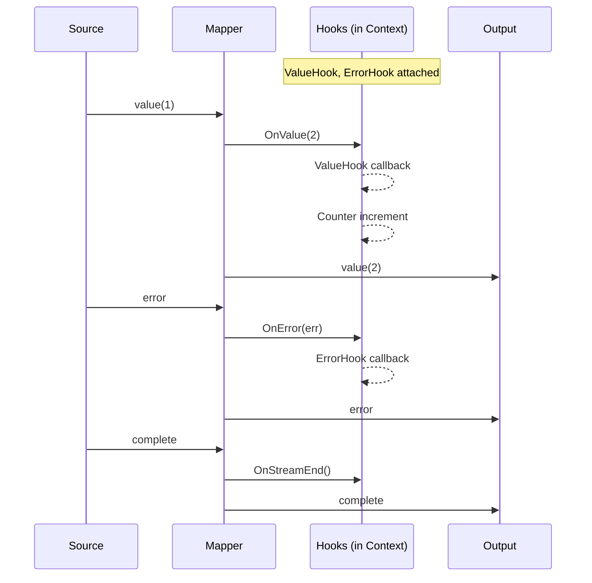

# observe

The `observe` package provides typed hooks for monitoring, debugging, and collecting metrics from streams without affecting their behavior.

## Overview

Observability is crucial for understanding stream behavior in production. This package provides **typed hooks** that attach to context and fire automatically during stream processing.

Key benefits:

- **Type-safe**: Hooks are parameterized by stream element type
- **Zero pipeline overhead**: Hooks don't add stages to your stream
- **Context-based**: Attach hooks to context, they propagate automatically
- **Composable**: Multiple hooks of different types can coexist



## Quick Start

```go
import (
    "context"
    "fmt"

    "github.com/lguimbarda/min-flow/flow"
    "github.com/lguimbarda/min-flow/flow/observe"
)

func main() {
    ctx := context.Background()

    // Attach typed hooks to context
    ctx, counter := observe.WithCounter[int](ctx)
    ctx = observe.WithValueHook(ctx, func(v int) {
        fmt.Printf("Value: %d\n", v)
    })
    ctx = observe.WithErrorHook(ctx, func(err error) {
        fmt.Printf("Error: %v\n", err)
    })

    // Process stream - hooks fire automatically during Emit()
    stream := flow.FromSlice([]int{1, 2, 3, 4, 5})
    doubled := flow.Map(func(n int) (int, error) {
        return n * 2, nil
    }).Apply(stream)

    _, _ = flow.Slice(ctx, doubled)
    fmt.Printf("Processed %d items\n", counter.Load())
}
```

## Hook Registration Functions

### Value Observation

```go
// Observe each value with a callback
ctx = observe.WithValueHook(ctx, func(v int) {
    fmt.Println("Got value:", v)
})

// Count all values processed
ctx, counter := observe.WithCounter[int](ctx)
// Later: counter.Load() returns total count

// Count values matching a condition
ctx, counter := observe.WithValueCounter(ctx, func(v int) bool {
    return v > 10  // Only count values > 10
})
```

### Error Observation

```go
// Observe each error with a callback
ctx = observe.WithErrorHook(ctx, func(err error) {
    log.Printf("Stream error: %v", err)
})
```

### Logging

```go
// Log stream events with a custom logger
ctx = observe.WithLogging[int](ctx, func(format string, args ...any) {
    log.Printf(format, args...)
})
```

### Composite Hooks

```go
// Combine multiple observations in one call
ctx, counter := observe.WithObserver(ctx, observe.ObserverConfig[int]{
    OnValue: func(v int) { fmt.Printf("Value: %d\n", v) },
    OnError: func(err error) { log.Printf("Error: %v", err) },
})
```

## Low-Level Hooks API

For full control, use the core package directly:

```go
import "github.com/lguimbarda/min-flow/flow/core"

ctx = core.WithHooks(ctx, core.Hooks[int]{
    OnValue:       func(v int) { /* called per value */ },
    OnError:       func(err error) { /* called per error */ },
    OnStreamStart: func() { /* called when stream starts */ },
    OnStreamEnd:   func() { /* called when stream ends */ },
})
```

## Hook Composition

Multiple hooks of the same type are merged - all callbacks fire:

```go
ctx := context.Background()

// First value hook
ctx = observe.WithValueHook(ctx, func(v int) {
    fmt.Println("Hook 1:", v)
})

// Second value hook - both will fire
ctx = observe.WithValueHook(ctx, func(v int) {
    fmt.Println("Hook 2:", v)
})
```

Different typed hooks coexist independently:

```go
ctx := context.Background()
ctx, intCounter := observe.WithCounter[int](ctx)
ctx, strCounter := observe.WithCounter[string](ctx)

// intCounter tracks int streams, strCounter tracks string streams
```

## Data Flow with Hooks



## Error Tracking

For specialized error tracking, see the `flowerrors` package:

```go
import "github.com/lguimbarda/min-flow/flow/flowerrors"

// Count errors
ctx, errorCounter := flowerrors.WithErrorCounter[int](ctx, nil)

// Collect all errors
ctx, collector := flowerrors.WithErrorCollector[int](ctx)
// Later: collector.Errors()

// Monitor error rate with circuit breaker pattern
ctx = flowerrors.WithCircuitBreakerMonitor[int](ctx, 5, func() {
    log.Println("Error threshold exceeded!")
})
```

## When to Use Which Hook

| Hook                                   | Use Case                         |
| -------------------------------------- | -------------------------------- |
| `WithValueHook`                        | Debug logging, custom metrics    |
| `WithErrorHook`                        | Error logging, alerting          |
| `WithCounter`                          | Simple throughput counting       |
| `WithValueCounter`                     | Conditional counting             |
| `WithLogging`                          | Development debugging            |
| `flowerrors.WithErrorCollector`        | Batch error analysis             |
| `flowerrors.WithCircuitBreakerMonitor` | Production error rate monitoring |

## Performance Considerations

- Hooks add minimal overhead (function call per item)
- Counter uses `atomic.Int64` for thread-safe counting
- Hooks are invoked synchronously - keep callbacks fast
- For high-throughput scenarios, consider sampling or async logging
