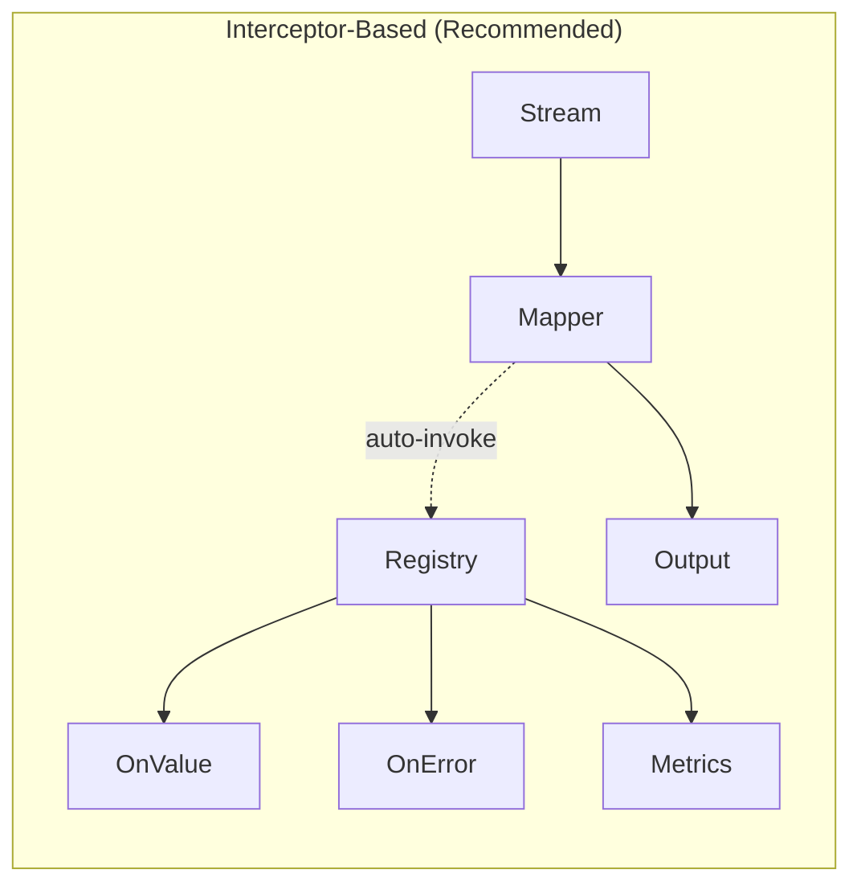
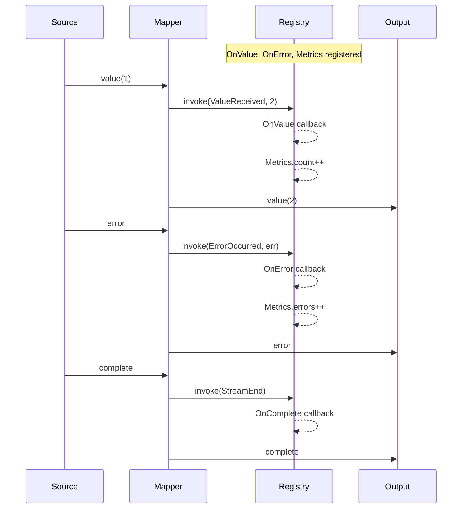

# observe

The `observe` package provides operators for monitoring, debugging, and collecting metrics from streams without affecting their behavior.

## Overview

Observability is crucial for understanding stream behavior in production. This package offers two approaches:

1. **Interceptor-based (Recommended)**: Register observers with a registry, and they're automatically invoked by all stream operations
2. **Transformer-based (Deprecated)**: Explicit pipeline stages for observation

The interceptor-based approach is preferred because:

- No pipeline overhead - observers don't add stages to your stream
- Global visibility - see all events across the entire pipeline
- Simpler code - register once, observe everywhere



## Quick Start: Interceptor-Based Observation

```go
// Set up registry and observers
ctx, registry := core.WithRegistry(context.Background())

// Register observers - they'll be called automatically
observe.OnValue(registry, func(v any) {
    fmt.Printf("Value: %v\n", v)
})
observe.OnError(registry, func(err error) {
    log.Printf("Error: %v", err)
})
observe.OnComplete(registry, func() {
    fmt.Println("Stream completed")
})

// Process stream - observers fire automatically!
result := mapper.Apply(ctx, stream)
values, _ := core.Slice(ctx, result)
```

## Registration Functions

### Basic Callbacks

```go
// Observe values
observe.OnValue(registry, func(v any) {
    fmt.Println("Got value:", v)
})

// Observe errors
observe.OnError(registry, func(err error) {
    log.Error("Stream error:", err)
})

// Observe stream lifecycle
observe.OnStart(registry, func() {
    fmt.Println("Stream started")
})
observe.OnComplete(registry, func() {
    fmt.Println("Stream completed")
})
```

### Metrics Collection

```go
// Counter - counts values, errors, sentinels
counter, _ := observe.WithCounter(registry)
// Later: counter.Values(), counter.Errors(), counter.Total()

// Simple value counter
valueCounter, _ := observe.WithValueCounter(registry)
// Later: valueCounter.Count()

// Error collector
collector, _ := observe.WithErrorCollector(registry)
// Later: collector.Errors(), collector.HasErrors()

// Metrics with callback on completion
metrics, _ := observe.WithMetrics(registry, func(m observe.StreamMetrics) {
    fmt.Printf("Processed %d items in %v\n", m.TotalItems, m.Duration)
})

// Live metrics (query anytime)
liveMetrics, _ := observe.WithLiveMetrics(registry)
// Later: liveMetrics.ItemCount(), liveMetrics.ErrorCount()
```

### Logging

```go
// Log specific events
observe.WithLogging(registry, log.Printf, core.ValueReceived, core.ErrorOccurred)

// Log all events
observe.WithLogging(registry, log.Printf)
```

## Built-in Interceptors

For more control, use the interceptor types directly:

```go
// Metrics interceptor with callback
metrics := observe.NewMetricsInterceptor(func(m observe.StreamMetrics) {
    fmt.Printf("Total: %d, Errors: %d, Duration: %v\n",
        m.TotalItems, m.ErrorCount, m.Duration)
})
registry.Register(metrics)

// Counter interceptor
counter := observe.NewCounterInterceptor()
registry.Register(counter)
// Query: counter.Values(), counter.Errors(), counter.Sentinels()

// Callback interceptor for custom handling
callback := observe.NewCallbackInterceptor(
    observe.WithOnValue(func(v any) { /* handle value */ }),
    observe.WithOnError(func(err error) { /* handle error */ }),
    observe.WithOnStart(func() { /* handle start */ }),
    observe.WithOnComplete(func() { /* handle complete */ }),
)
registry.Register(callback)

// Log interceptor
logger := observe.NewLogInterceptor(log.Printf, core.ValueReceived, core.ErrorOccurred)
registry.Register(logger)
```

## StreamMetrics

The metrics interceptors collect:

| Metric           | Description           |
| ---------------- | --------------------- |
| `TotalItems`     | Total items processed |
| `ValueCount`     | Successful values     |
| `ErrorCount`     | Error results         |
| `SentinelCount`  | Sentinel signals      |
| `StartTime`      | When stream started   |
| `EndTime`        | When stream ended     |
| `Duration`       | Total processing time |
| `ItemsPerSecond` | Throughput            |

## Data Flow with Interceptors



## Deprecated Transformer-Based Operators

The following operators are deprecated. Use the interceptor-based alternatives:

| Deprecated                  | Use Instead                        |
| --------------------------- | ---------------------------------- |
| `DoOnNext[T](handler)`      | `OnValue(registry, handler)`       |
| `DoOnError[T](handler)`     | `OnError(registry, handler)`       |
| `DoOnComplete[T](handler)`  | `OnComplete(registry, handler)`    |
| `DoOnSubscribe[T](handler)` | `OnStart(registry, handler)`       |
| `Tap[T](handlers)`          | `OnValue`, `OnError`, `OnComplete` |
| `Meter[T](callback)`        | `WithMetrics(registry, callback)`  |
| `MeterLive[T](metrics)`     | `WithLiveMetrics(registry)`        |
| `CountValues[T](callback)`  | `WithCounter(registry)`            |
| `Log[T](formatter, logger)` | `WithLogging(registry, logger)`    |

These deprecated operators still work but add unnecessary pipeline stages.

## When to Use

| Approach                  | Use Case                                |
| ------------------------- | --------------------------------------- |
| `OnValue`, `OnError`      | Simple callbacks for logging/metrics    |
| `WithCounter`             | Counting items processed                |
| `WithMetrics`             | Comprehensive stream statistics         |
| `WithLogging`             | Debug logging                           |
| Custom Interceptor        | Complex cross-cutting concerns          |
| `MaterializeNotification` | Testing, serialization (not deprecated) |
