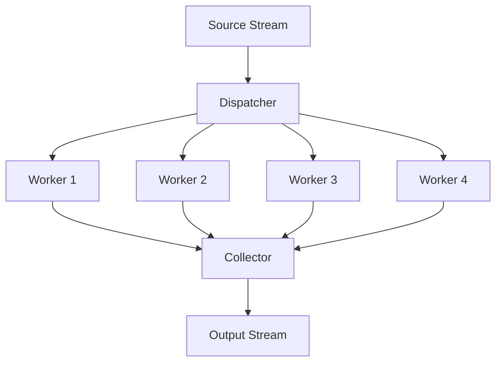
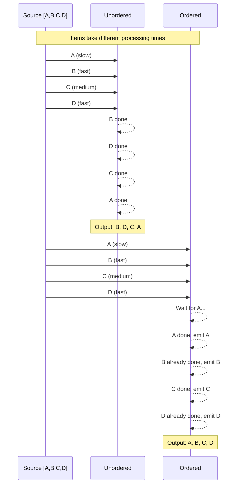
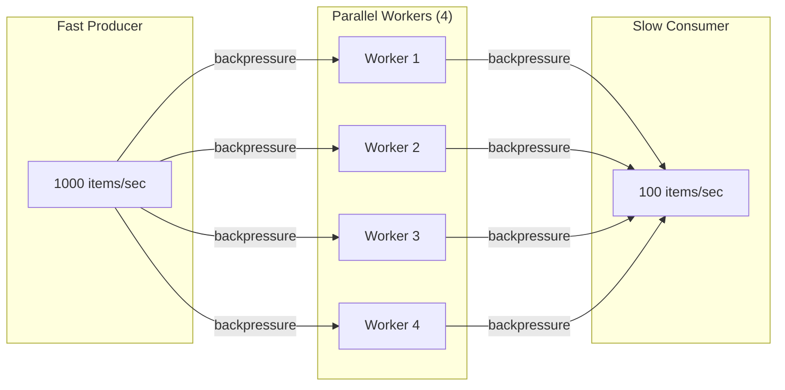

# parallel

The `parallel` package provides operators for concurrent stream processing using worker pools.

## Overview

Parallel processing enables high throughput for CPU-bound or I/O-bound operations by distributing work across multiple goroutines.



## Operators

### Parallel Map

Process items concurrently with multiple workers:

```go
// Process with 4 workers (results may be out of order)
processed := parallel.Map(4, func(item Request) Response {
    return callAPI(item)
}).Apply(ctx, stream)

// With error handling
processed := parallel.MapErr(4, func(item Request) (Response, error) {
    return callAPIWithRetry(item)
}).Apply(ctx, stream)
```

### Ordered Parallel Map

Preserve input order while processing in parallel:

```go
// Process in parallel but emit in original order
ordered := parallel.MapOrdered(4, func(item Request) Response {
    return process(item)
}).Apply(ctx, stream)
```

### Parallel FlatMap

Expand items concurrently:

```go
// Each item produces multiple outputs, processed in parallel
expanded := parallel.FlatMap(4, func(userId string) []Order {
    return fetchOrders(userId)
}).Apply(ctx, stream)
```

### Parallel ForEach

Execute side effects concurrently:

```go
// Process items for side effects with worker pool
parallel.ForEach(4, func(item Event) {
    sendToAnalytics(item)
}).Apply(ctx, stream)
```

## Ordered vs Unordered



### When to Use Each

| Pattern           | Use Case                          | Tradeoff                          |
| ----------------- | --------------------------------- | --------------------------------- |
| `Map` (unordered) | Independent items, max throughput | Items may reorder                 |
| `MapOrdered`      | Order matters                     | Buffers until slow items complete |
| Single worker     | Order required, simple            | No parallelism                    |

## Configuration

Use `ParallelConfig` for default worker counts:

```go
ctx, registry := core.WithRegistry(ctx)
registry.Register(&parallel.ParallelConfig{
    Workers: 8,
})

// Now Map(0, ...) uses 8 workers
processed := parallel.Map(0, process).Apply(ctx, stream)

// Explicit worker count overrides config
processed := parallel.Map(4, process).Apply(ctx, stream)
```

## Backpressure

Parallel operators respect backpressure:



When the consumer is slow, workers block on output, which blocks the dispatcher, which slows consumption from the source.

## Concurrency Patterns

### CPU-Bound Work

```go
// Match worker count to CPU cores
workers := runtime.NumCPU()
result := parallel.Map(workers, cpuIntensiveTask).Apply(ctx, stream)
```

### I/O-Bound Work

```go
// More workers than cores for I/O-bound tasks
workers := 50 // or based on connection pool size
result := parallel.Map(workers, fetchFromAPI).Apply(ctx, stream)
```

### Mixed Workloads

```go
// Pipeline with different parallelism at each stage
stream.
    Apply(ctx, parallel.Map(runtime.NumCPU(), cpuBoundParse)).
    Apply(ctx, parallel.Map(50, ioBoundEnrich)).
    Apply(ctx, parallel.Map(runtime.NumCPU(), cpuBoundTransform))
```

## Error Handling

Errors from any worker are emitted to the output stream:

```go
processed := parallel.MapErr(4, func(item Request) (Response, error) {
    resp, err := callAPI(item)
    if err != nil {
        return Response{}, err // Becomes error Result
    }
    return resp, nil
}).Apply(ctx, stream)

// Handle errors downstream
result := processed.Apply(ctx, flowerrors.OnError(logError))
```

## When to Use

| Scenario              | Recommendation                 |
| --------------------- | ------------------------------ |
| CPU-bound processing  | Workers = NumCPU               |
| I/O-bound (API calls) | Workers = connection pool size |
| Order required        | `MapOrdered`                   |
| Max throughput        | `Map` (unordered)              |
| Side effects          | `ForEach`                      |
| Item expansion        | `FlatMap`                      |
