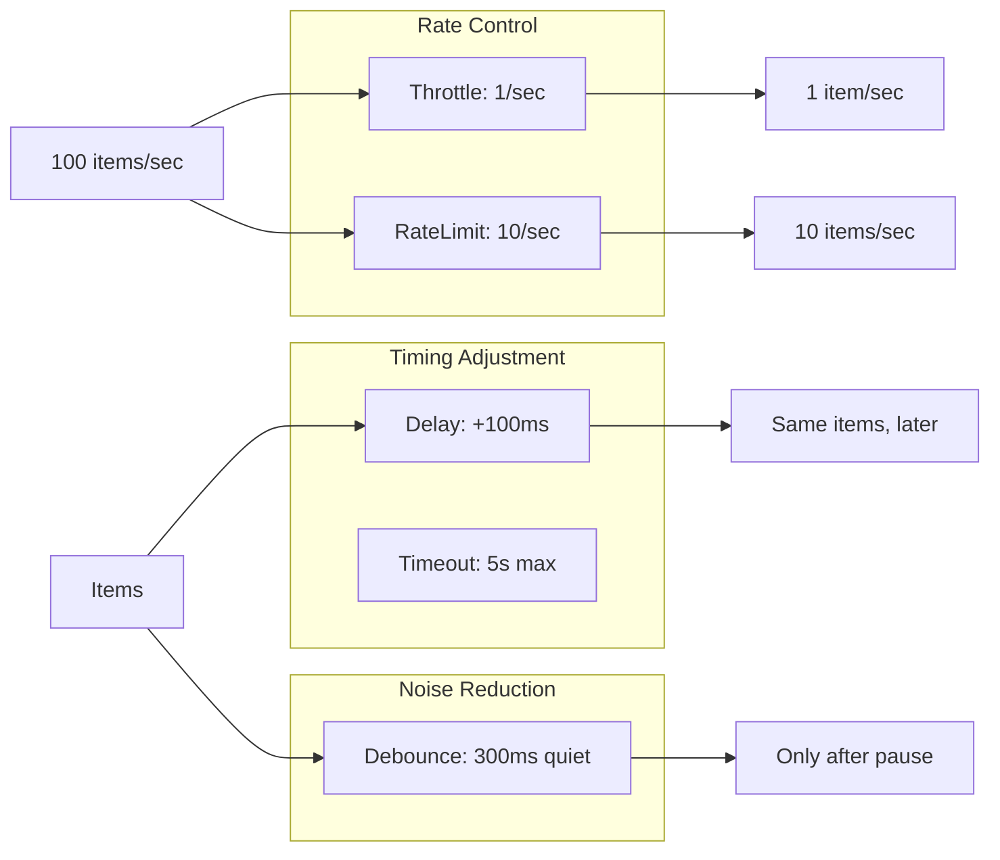
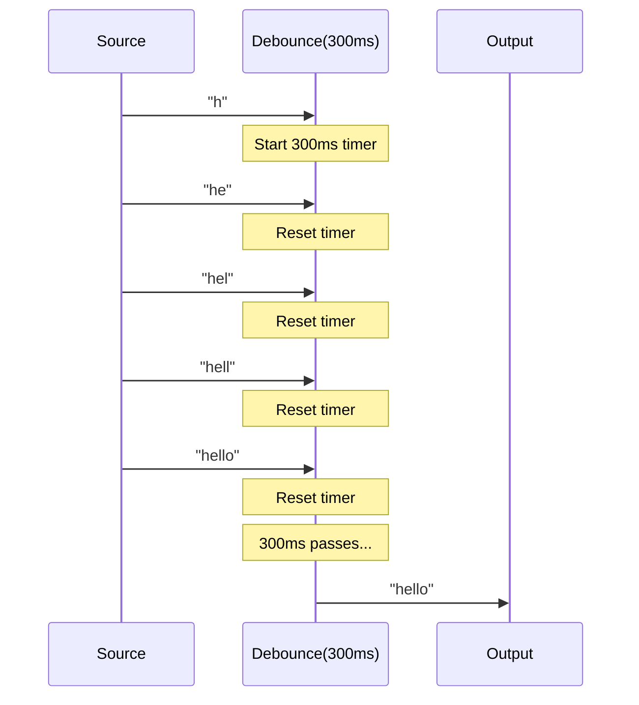
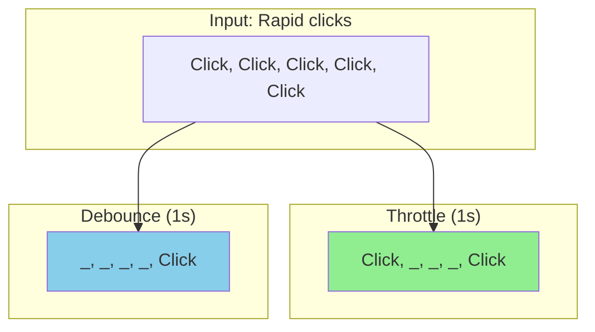

# timing

The `timing` package provides operators for time-based stream control including delays, throttling, debouncing, and rate limiting.

## Overview

Time-based operators control the temporal behavior of streams—when items are emitted, how fast they flow, and how to handle timing constraints.



## Operators

### Delay

Add latency to item emissions:

```go
// Delay each item by 100ms
delayed := timing.Delay[int](100 * time.Millisecond).Apply(ctx, stream)

// Delay with jitter (random variation)
jittered := timing.DelayWithJitter[int](
    100*time.Millisecond,  // base delay
    50*time.Millisecond,   // jitter range
).Apply(ctx, stream)
```

### Throttle

Limit emission rate by dropping items:

```go
// Emit at most 1 item per second (drop others)
throttled := timing.Throttle[int](time.Second).Apply(ctx, stream)

// Throttle but emit trailing item when window closes
withTrailing := timing.ThrottleWithTrailing[int](time.Second).Apply(ctx, stream)

// ThrottleFirst: emit first, ignore rest of window
first := timing.ThrottleFirst[int](time.Second).Apply(ctx, stream)

// ThrottleLast: emit last item of each window
last := timing.ThrottleLast[int](time.Second).Apply(ctx, stream)
```

### Debounce

Wait for silence before emitting:

```go
// Emit only after 300ms of no new items
debounced := timing.Debounce[int](300 * time.Millisecond).Apply(ctx, stream)

// Useful for: search-as-you-type, resize events, etc.
```



### Rate Limiting

Control throughput with token bucket:

```go
// Allow 10 items per second with burst of 5
limited := timing.RateLimit[int](10, 5).Apply(ctx, stream)

// Strict rate limit (no burst)
strict := timing.RateLimit[int](100, 1).Apply(ctx, stream)
```

### Timeout

Limit time for items or entire stream:

```go
// Timeout between items (resets on each item)
timed := timing.Timeout[int](5 * time.Second).Apply(ctx, stream)

// Timeout for entire stream
total := timing.TotalTimeout[int](1 * time.Minute).Apply(ctx, stream)

// With custom timeout error
custom := timing.TimeoutWith[int](
    5*time.Second,
    errors.New("item timeout exceeded"),
).Apply(ctx, stream)
```

### Sampling

Periodic value capture:

```go
// Emit latest value every second
sampled := timing.Sample[int](time.Second).Apply(ctx, stream)

// Emit latest value only when it changes within interval
distinctSampled := timing.SampleDistinct[int](time.Second).Apply(ctx, stream)
```

## Comparison

### Throttle vs Debounce



| Operator     | Behavior                           | Use Case                |
| ------------ | ---------------------------------- | ----------------------- |
| **Throttle** | Emit first, drop until window ends | Rate limiting API calls |
| **Debounce** | Wait for silence, emit last        | Search input, resize    |

### Rate Limit vs Throttle

| Operator      | Behavior                   | Use Case                 |
| ------------- | -------------------------- | ------------------------ |
| **RateLimit** | Token bucket, allows burst | API with burst allowance |
| **Throttle**  | Fixed window, no burst     | Strict rate control      |

## Buffering

Time-based buffering:

```go
// Buffer items for 5 seconds, then emit as batch
buffered := timing.BufferTime[int](5 * time.Second).Apply(ctx, stream)
// Emits []int every 5 seconds

// Buffer with sliding window
sliding := timing.BufferTimeSliding[int](
    10*time.Second,  // window size
    2*time.Second,   // slide interval
).Apply(ctx, stream)
```

## Timestamp Operations

```go
// Add timestamps to items
timestamped := timing.Timestamp[int]().Apply(ctx, stream)
// Emits Timestamped[int]{Value: 42, Time: time.Now()}

// Measure interval between items
intervals := timing.TimeInterval[int]().Apply(ctx, stream)
// Emits Timed[int]{Value: 42, Interval: 150ms}
```

## When to Use

| Operator     | Use Case                           |
| ------------ | ---------------------------------- |
| `Delay`      | Simulate latency, stagger requests |
| `Throttle`   | UI events, prevent rapid fire      |
| `Debounce`   | Search input, window resize        |
| `RateLimit`  | API rate limits with burst         |
| `Timeout`    | Detect stalled streams             |
| `Sample`     | Reduce high-frequency data         |
| `BufferTime` | Batch by time window               |
