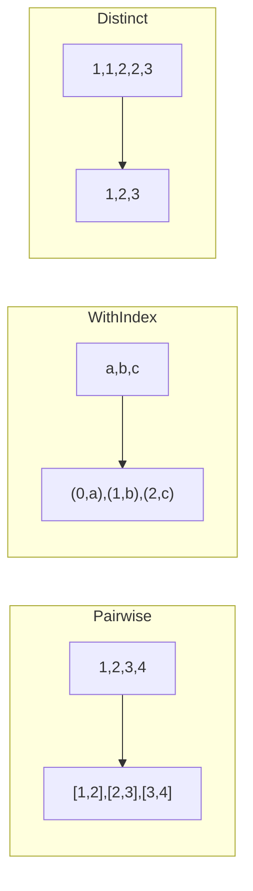
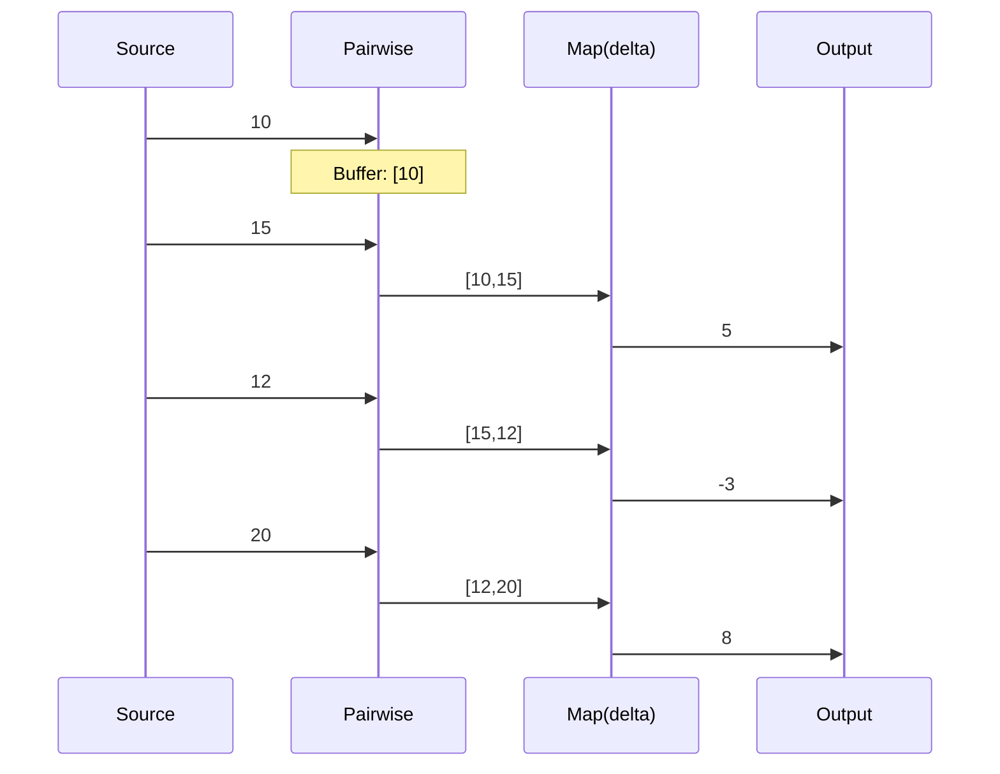

# transform

The `transform` package provides utility operators for common stream transformations beyond basic mapping.

## Overview

These operators handle common transformation patterns like pairing consecutive items, adding indexes, deduplication, and value decoration.



## Operators

### Pairwise Operations

```go
// Pairwise: emit consecutive pairs
pairs := transform.Pairwise[int]().Apply(ctx, stream)
// [1,2,3,4] → [[1,2], [2,3], [3,4]]

// Useful for calculating deltas
deltas := stream.
    Apply(ctx, transform.Pairwise[int]()).
    Apply(ctx, flow.Map(func(p [2]int) int {
        return p[1] - p[0]
    }))
```

### Indexing

```go
// WithIndex: add index to each item
indexed := transform.WithIndex[string]().Apply(ctx, stream)
// ["a","b","c"] → [{0,"a"}, {1,"b"}, {2,"c"}]

// Access via Indexed[T] type
for item := range indexed.All(ctx) {
    fmt.Printf("%d: %s\n", item.Value().Index, item.Value().Value)
}
```

### Prepend/Append

```go
// StartWith: prepend values before stream
withHeader := transform.StartWith("header1", "header2").Apply(ctx, stream)
// stream: [a,b,c] → [header1, header2, a, b, c]

// EndWith: append values after stream
withFooter := transform.EndWith("footer").Apply(ctx, stream)
// stream: [a,b,c] → [a, b, c, footer]

// Concat operator in combine package for stream-level append
```

### Default Values

```go
// DefaultIfEmpty: emit default if stream is empty
withDefault := transform.DefaultIfEmpty(0).Apply(ctx, stream)

// SwitchIfEmpty: use alternative stream if empty
withFallback := transform.SwitchIfEmpty(fallbackStream).Apply(ctx, stream)
```

### Deduplication

```go
// Distinct: remove consecutive duplicates
unique := transform.Distinct[int]().Apply(ctx, stream)
// [1,1,2,2,2,3,1,1] → [1,2,3,1]

// DistinctBy: distinct by key function
uniqueUsers := transform.DistinctBy(func(u User) string {
    return u.Email
}).Apply(ctx, stream)

// DistinctUntilChanged: only emit when value changes
changes := transform.DistinctUntilChanged[int]().Apply(ctx, stream)
// Same as Distinct for simple types
```

### Repeating

```go
// Repeat: repeat entire stream N times
repeated := transform.Repeat[int](3).Apply(ctx, stream)
// [1,2] → [1,2,1,2,1,2]

// RepeatWhen: repeat based on notifier
conditional := transform.RepeatWhen(notifierStream).Apply(ctx, stream)
```

### Flattening

```go
// Flatten: flatten nested slices
flat := transform.Flatten[int]().Apply(ctx, sliceStream)
// [[1,2], [3,4]] → [1,2,3,4]

// FlattenDeep: recursively flatten (for deeply nested)
deep := transform.FlattenDeep[int](2).Apply(ctx, nestedStream)
```

### Grouping

```go
// GroupBy: group items by key (emits map when complete)
grouped := transform.GroupBy(func(p Person) string {
    return p.Department
}).Apply(ctx, stream)
// Emits: map[string][]Person

// GroupByWithMapper: group and transform
grouped := transform.GroupByWithMapper(
    func(p Person) string { return p.Department },
    func(p Person) string { return p.Name },
).Apply(ctx, stream)
// Emits: map[string][]string (department → names)
```

### Scanning

```go
// Scan: running accumulation (emits intermediate values)
running := transform.Scan(0, func(acc, item int) int {
    return acc + item
}).Apply(ctx, stream)
// [1,2,3,4] → [1,3,6,10]

// Unlike Reduce which only emits final value
```

## Data Flow Examples

### Pairwise for Deltas



### WithIndex Usage

```go
// Find position of first match
type Match struct {
    Index int
    Value string
}

matches := stream.
    Apply(ctx, transform.WithIndex[string]()).
    Apply(ctx, filter.Where(func(idx transform.Indexed[string]) bool {
        return strings.Contains(idx.Value, "error")
    }))
```

## When to Use

| Operator    | Use Case                              |
| ----------- | ------------------------------------- |
| `Pairwise`  | Calculate differences, detect changes |
| `WithIndex` | Track position, add sequence numbers  |
| `StartWith` | Add headers, initial values           |
| `Distinct`  | Remove consecutive duplicates         |
| `Scan`      | Running totals, state accumulation    |
| `Flatten`   | Unwrap nested collections             |
| `GroupBy`   | Categorize items                      |
| `Repeat`    | Retry logic, cycling data             |
